# Distributed systems diagrams

## A streaming lakehouse and its query paths

High-level composition. The Iceberg catalog and object store are distinct services; Rust and Arrow operate inside native execution processes.

Source references: iceberg-flink, comet-jni, df-iceberg.

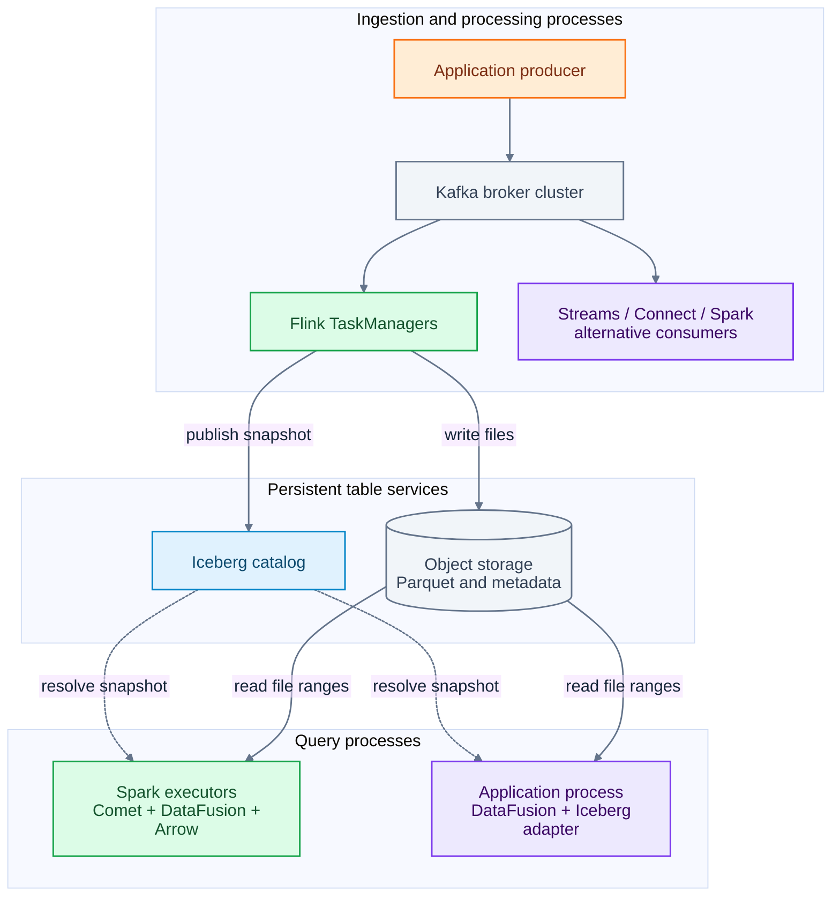
```mermaid
%%{init: {"theme":"base","htmlLabels":false,"themeVariables":{"fontFamily":"Ubuntu, Arial, sans-serif","fontSize":"17px","primaryTextColor":"#142337","lineColor":"#718096","actorBkg":"#eaf2fa","actorBorder":"#53728c","actorTextColor":"#142337","signalColor":"#526479","signalTextColor":"#142337","noteBkgColor":"#fff7d6","noteTextColor":"#423511"},"flowchart":{"curve":"basis","nodeSpacing":42,"rankSpacing":65,"htmlLabels":false,"padding":20},"sequence":{"useMaxWidth":false,"actorMargin":55,"boxMargin":18,"messageMargin":34,"noteMargin":16,"diagramMarginX":24,"diagramMarginY":24,"wrap":true,"width":175}}}%%
flowchart TB

subgraph ingest["Ingestion and processing processes"]
 P["Application producer"]:::io --> K["Kafka broker cluster"]:::store
 K --> F["Flink TaskManagers"]:::worker
 K --> A["Streams / Connect / Spark
alternative consumers"]:::runtime
end
subgraph storage["Persistent table services"]
 F -->|"write files"| O[("Object storage
Parquet and metadata")]:::store
 F -->|"publish snapshot"| C["Iceberg catalog"]:::control
end
subgraph query["Query processes"]
 S["Spark executors
Comet + DataFusion + Arrow"]:::worker
 D["Application process
DataFusion + Iceberg adapter"]:::runtime
 C -. "resolve snapshot" .-> S
 C -. "resolve snapshot" .-> D
 O -->|"read file ranges"| S
 O -->|"read file ranges"| D
end

classDef control fill:#e0f2fe,stroke:#0284c7,color:#0c4a6e,stroke-width:1.6px
classDef worker fill:#dcfce7,stroke:#16a34a,color:#14532d,stroke-width:1.6px
classDef runtime fill:#ede9fe,stroke:#7c3aed,color:#3b0764,stroke-width:1.6px
classDef io fill:#ffedd5,stroke:#f97316,color:#7c2d12,stroke-width:1.6px
classDef state fill:#fef9c3,stroke:#ca8a04,color:#713f12,stroke-width:1.6px
classDef store fill:#f1f5f9,stroke:#64748b,color:#334155,stroke-width:1.6px
classDef fail fill:#fee2e2,stroke:#dc2626,color:#7f1d1d,stroke-width:1.6px
linkStyle default stroke:#64748b,stroke-width:1.6px,stroke-linecap:round

```

## Control, data and recovery planes

Separate paths prevent the common mistake of drawing every record through a coordinator.

Source references: flink-deploy, spark-launch, flink-checkpoint.

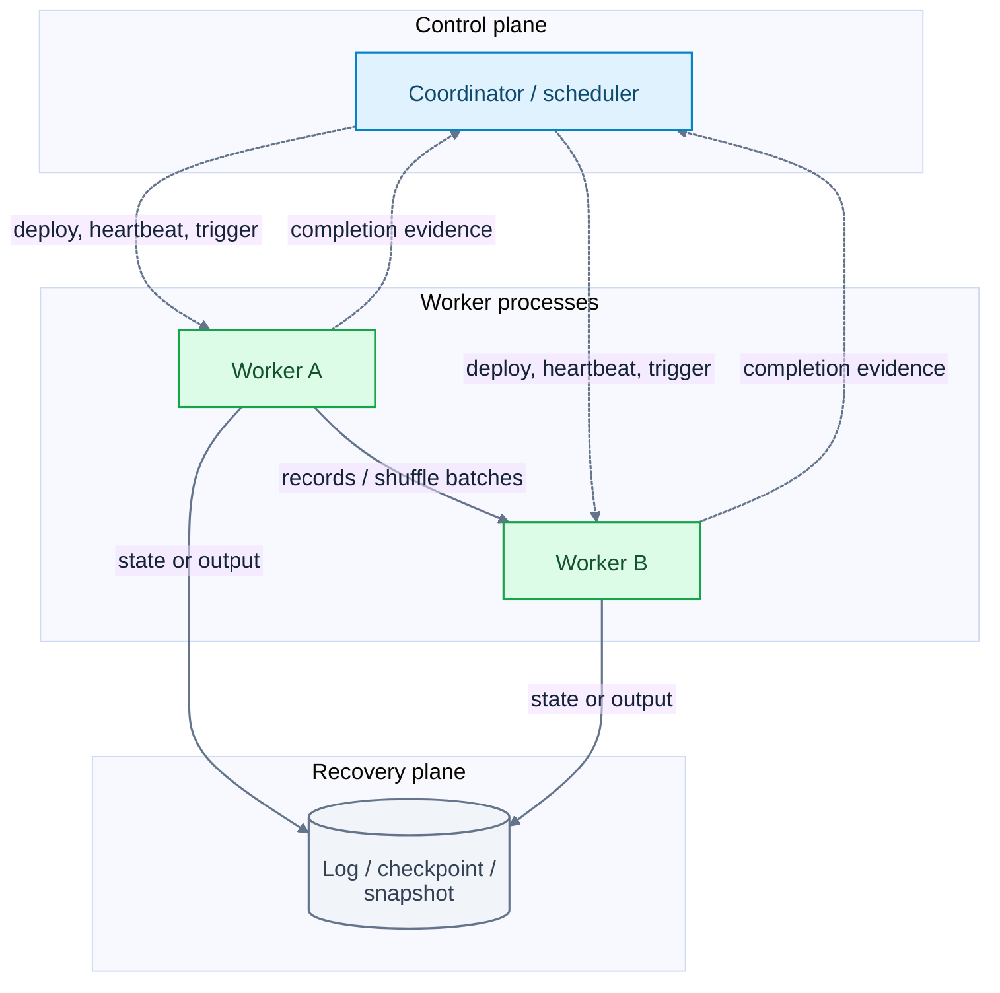
```mermaid
%%{init: {"theme":"base","htmlLabels":false,"themeVariables":{"fontFamily":"Ubuntu, Arial, sans-serif","fontSize":"17px","primaryTextColor":"#142337","lineColor":"#718096","actorBkg":"#eaf2fa","actorBorder":"#53728c","actorTextColor":"#142337","signalColor":"#526479","signalTextColor":"#142337","noteBkgColor":"#fff7d6","noteTextColor":"#423511"},"flowchart":{"curve":"basis","nodeSpacing":42,"rankSpacing":65,"htmlLabels":false,"padding":20},"sequence":{"useMaxWidth":false,"actorMargin":55,"boxMargin":18,"messageMargin":34,"noteMargin":16,"diagramMarginX":24,"diagramMarginY":24,"wrap":true,"width":175}}}%%
flowchart TB

subgraph control["Control plane"]
 C["Coordinator / scheduler"]:::control
end
subgraph workers["Worker processes"]
 A["Worker A"]:::worker
 B["Worker B"]:::worker
 A -->|"records / shuffle batches"| B
end
subgraph persistence["Recovery plane"]
 S[("Log / checkpoint / snapshot")]:::store
end
 C -. "deploy, heartbeat, trigger" .-> A
 C -. "deploy, heartbeat, trigger" .-> B
 A -->|"state or output"| S
 B -->|"state or output"| S
 A -. "completion evidence" .-> C
 B -. "completion evidence" .-> C

classDef control fill:#e0f2fe,stroke:#0284c7,color:#0c4a6e,stroke-width:1.6px
classDef worker fill:#dcfce7,stroke:#16a34a,color:#14532d,stroke-width:1.6px
classDef runtime fill:#ede9fe,stroke:#7c3aed,color:#3b0764,stroke-width:1.6px
classDef io fill:#ffedd5,stroke:#f97316,color:#7c2d12,stroke-width:1.6px
classDef state fill:#fef9c3,stroke:#ca8a04,color:#713f12,stroke-width:1.6px
classDef store fill:#f1f5f9,stroke:#64748b,color:#334155,stroke-width:1.6px
classDef fail fill:#fee2e2,stroke:#dc2626,color:#7f1d1d,stroke-width:1.6px
linkStyle default stroke:#64748b,stroke-width:1.6px,stroke-linecap:round

```

## Kafka deployment topology

A broker can host leaders, follower replicas and coordinators for different partitions. The controller role may run separately or share a process depending on deployment.

Source references: kafka-api, kafka-controller, kafka-txn-state.

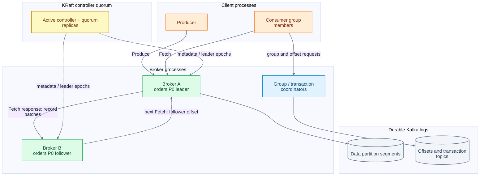
```mermaid
%%{init: {"theme":"base","htmlLabels":false,"themeVariables":{"fontFamily":"Ubuntu, Arial, sans-serif","fontSize":"17px","primaryTextColor":"#142337","lineColor":"#718096","actorBkg":"#eaf2fa","actorBorder":"#53728c","actorTextColor":"#142337","signalColor":"#526479","signalTextColor":"#142337","noteBkgColor":"#fff7d6","noteTextColor":"#423511"},"flowchart":{"curve":"basis","nodeSpacing":42,"rankSpacing":65,"htmlLabels":false,"padding":20},"sequence":{"useMaxWidth":false,"actorMargin":55,"boxMargin":18,"messageMargin":34,"noteMargin":16,"diagramMarginX":24,"diagramMarginY":24,"wrap":true,"width":175}}}%%
flowchart TB

subgraph clients["Client processes"]
 P["Producer"]:::io
 U["Consumer group members"]:::io
end
subgraph brokers["Broker processes"]
 L["Broker A
orders P0 leader"]:::worker
 R["Broker B
orders P0 follower"]:::worker
 G["Group / transaction coordinators"]:::control
 L -->|"Fetch response: record batches"| R
 R -. "next Fetch: follower offset" .-> L
end
subgraph durable["Durable Kafka logs"]
 D[("Data partition segments")]:::store
 I[("Offsets and transaction topics")]:::store
end
subgraph metadata["KRaft controller quorum"]
 Q["Active controller + quorum replicas"]:::state
end
 P -->|"Produce"| L
 U -->|"Fetch"| L
 U -->|"group and offset requests"| G
 L --> D
 G --> I
 Q -. "metadata / leader epochs" .-> L
 Q -. "metadata / leader epochs" .-> R

classDef control fill:#e0f2fe,stroke:#0284c7,color:#0c4a6e,stroke-width:1.6px
classDef worker fill:#dcfce7,stroke:#16a34a,color:#14532d,stroke-width:1.6px
classDef runtime fill:#ede9fe,stroke:#7c3aed,color:#3b0764,stroke-width:1.6px
classDef io fill:#ffedd5,stroke:#f97316,color:#7c2d12,stroke-width:1.6px
classDef state fill:#fef9c3,stroke:#ca8a04,color:#713f12,stroke-width:1.6px
classDef store fill:#f1f5f9,stroke:#64748b,color:#334155,stroke-width:1.6px
classDef fail fill:#fee2e2,stroke:#dc2626,color:#7f1d1d,stroke-width:1.6px
linkStyle default stroke:#64748b,stroke-width:1.6px,stroke-linecap:round

```

## Successful produce with replication

Followers pull. Their subsequent fetch offsets let the leader observe replication progress. This diagram models a successful acks=all path, omitting protocol retries.

Source references: kafka-sender, kafka-replicas, kafka-partition, kafka-hw.

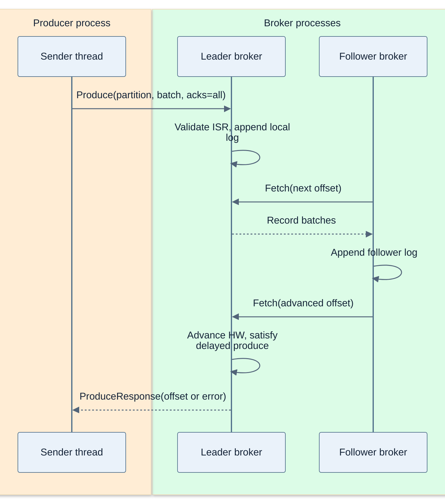
```mermaid
%%{init: {"theme":"base","htmlLabels":false,"themeVariables":{"fontFamily":"Ubuntu, Arial, sans-serif","fontSize":"17px","primaryTextColor":"#142337","lineColor":"#718096","actorBkg":"#eaf2fa","actorBorder":"#53728c","actorTextColor":"#142337","signalColor":"#526479","signalTextColor":"#142337","noteBkgColor":"#fff7d6","noteTextColor":"#423511"},"flowchart":{"curve":"basis","nodeSpacing":42,"rankSpacing":65,"htmlLabels":false,"padding":20},"sequence":{"useMaxWidth":false,"actorMargin":55,"boxMargin":18,"messageMargin":34,"noteMargin":16,"diagramMarginX":24,"diagramMarginY":24,"wrap":true,"width":175}}}%%
sequenceDiagram

box rgb(255,237,213) Producer process
 participant P as Sender thread
end
box rgb(220,252,231) Broker processes
 participant L as Leader broker
 participant F as Follower broker
end
 P->>L: Produce(partition, batch, acks=all)
 L->>L: Validate ISR, append local log
 F->>L: Fetch(next offset)
 L-->>F: Record batches
 F->>F: Append follower log
 F->>L: Fetch(advanced offset)
 L->>L: Advance HW, satisfy delayed produce
 L-->>P: ProduceResponse(offset or error)
```

## Inside the broker process

Network I/O and append processing are decoupled. A waiting all-ack request need not block a handler thread for the whole replication delay.

Source references: kafka-socket, kafka-api, kafka-replicas.

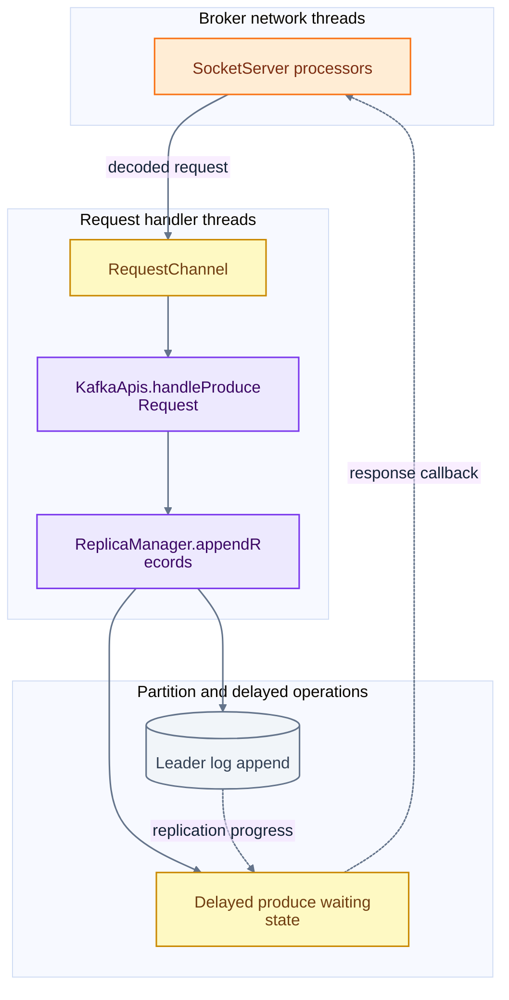
```mermaid
%%{init: {"theme":"base","htmlLabels":false,"themeVariables":{"fontFamily":"Ubuntu, Arial, sans-serif","fontSize":"17px","primaryTextColor":"#142337","lineColor":"#718096","actorBkg":"#eaf2fa","actorBorder":"#53728c","actorTextColor":"#142337","signalColor":"#526479","signalTextColor":"#142337","noteBkgColor":"#fff7d6","noteTextColor":"#423511"},"flowchart":{"curve":"basis","nodeSpacing":42,"rankSpacing":65,"htmlLabels":false,"padding":20},"sequence":{"useMaxWidth":false,"actorMargin":55,"boxMargin":18,"messageMargin":34,"noteMargin":16,"diagramMarginX":24,"diagramMarginY":24,"wrap":true,"width":175}}}%%
flowchart TB

subgraph network["Broker network threads"]
 N["SocketServer processors"]:::io
end
subgraph handlers["Request handler threads"]
 Q["RequestChannel"]:::state --> A["KafkaApis.handleProduceRequest"]:::runtime
 A --> R["ReplicaManager.appendRecords"]:::runtime
end
subgraph storage["Partition and delayed operations"]
 L[("Leader log append")]:::store
 W["Delayed produce waiting state"]:::state
end
 N -->|"decoded request"| Q
 R --> L
 R --> W
 L -. "replication progress" .-> W
 W -. "response callback" .-> N

classDef control fill:#e0f2fe,stroke:#0284c7,color:#0c4a6e,stroke-width:1.6px
classDef worker fill:#dcfce7,stroke:#16a34a,color:#14532d,stroke-width:1.6px
classDef runtime fill:#ede9fe,stroke:#7c3aed,color:#3b0764,stroke-width:1.6px
classDef io fill:#ffedd5,stroke:#f97316,color:#7c2d12,stroke-width:1.6px
classDef state fill:#fef9c3,stroke:#ca8a04,color:#713f12,stroke-width:1.6px
classDef store fill:#f1f5f9,stroke:#64748b,color:#334155,stroke-width:1.6px
classDef fail fill:#fee2e2,stroke:#dc2626,color:#7f1d1d,stroke-width:1.6px
linkStyle default stroke:#64748b,stroke-width:1.6px,stroke-linecap:round

```

## Read-process-write inside Kafka

Simplified protocol chronology. Marker fan-out includes participating output and offset state; version-specific optimizations are omitted.

Source references: streams-commit, kafka-txn, kafka-markers.

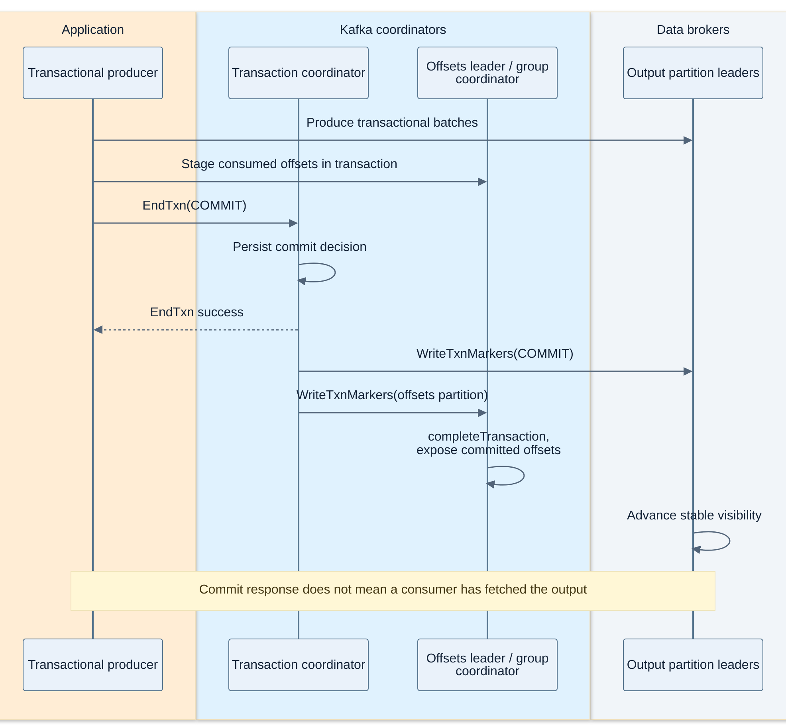
```mermaid
%%{init: {"theme":"base","htmlLabels":false,"themeVariables":{"fontFamily":"Ubuntu, Arial, sans-serif","fontSize":"17px","primaryTextColor":"#142337","lineColor":"#718096","actorBkg":"#eaf2fa","actorBorder":"#53728c","actorTextColor":"#142337","signalColor":"#526479","signalTextColor":"#142337","noteBkgColor":"#fff7d6","noteTextColor":"#423511"},"flowchart":{"curve":"basis","nodeSpacing":42,"rankSpacing":65,"htmlLabels":false,"padding":20},"sequence":{"useMaxWidth":false,"actorMargin":55,"boxMargin":18,"messageMargin":34,"noteMargin":16,"diagramMarginX":24,"diagramMarginY":24,"wrap":true,"width":175}}}%%
sequenceDiagram

box rgb(255,237,213) Application
 participant P as Transactional producer
end
box rgb(224,242,254) Kafka coordinators
 participant T as Transaction coordinator
 participant G as Offsets leader / group coordinator
end
box rgb(241,245,249) Data brokers
 participant B as Output partition leaders
end
 P->>B: Produce transactional batches
 P->>G: Stage consumed offsets in transaction
 P->>T: EndTxn(COMMIT)
 T->>T: Persist commit decision
 T-->>P: EndTxn success
 T->>B: WriteTxnMarkers(COMMIT)
 T->>G: WriteTxnMarkers(offsets partition)
 G->>G: completeTransaction, expose committed offsets
 B->>B: Advance stable visibility
 Note over P,B: Commit response does not mean a consumer has fetched the output
```

## A timeout is an unknown outcome until reconciled

This is a general distributed write decision tree. Kafka producer retries and transaction state resolve it within Kafka; external sinks need their own protocol.

Source references: kafka-txn, streams-commit.

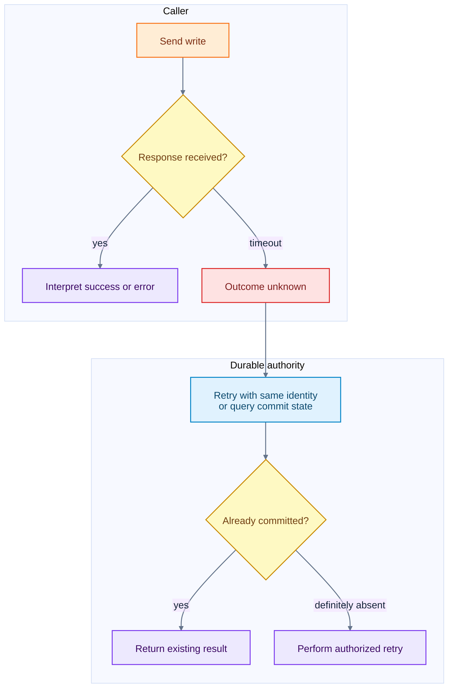
```mermaid
%%{init: {"theme":"base","htmlLabels":false,"themeVariables":{"fontFamily":"Ubuntu, Arial, sans-serif","fontSize":"17px","primaryTextColor":"#142337","lineColor":"#718096","actorBkg":"#eaf2fa","actorBorder":"#53728c","actorTextColor":"#142337","signalColor":"#526479","signalTextColor":"#142337","noteBkgColor":"#fff7d6","noteTextColor":"#423511"},"flowchart":{"curve":"basis","nodeSpacing":42,"rankSpacing":65,"htmlLabels":false,"padding":20},"sequence":{"useMaxWidth":false,"actorMargin":55,"boxMargin":18,"messageMargin":34,"noteMargin":16,"diagramMarginX":24,"diagramMarginY":24,"wrap":true,"width":175}}}%%
flowchart TB

subgraph caller["Caller"]
 S["Send write"]:::io --> Q{"Response received?"}:::state
 Q -->|"yes"| OK["Interpret success or error"]:::runtime
 Q -->|"timeout"| U["Outcome unknown"]:::fail
end
subgraph authority["Durable authority"]
 U --> R["Retry with same identity
or query commit state"]:::control
 R --> C{"Already committed?"}:::state
 C -->|"yes"| D["Return existing result"]:::runtime
 C -->|"definitely absent"| W["Perform authorized retry"]:::runtime
end

classDef control fill:#e0f2fe,stroke:#0284c7,color:#0c4a6e,stroke-width:1.6px
classDef worker fill:#dcfce7,stroke:#16a34a,color:#14532d,stroke-width:1.6px
classDef runtime fill:#ede9fe,stroke:#7c3aed,color:#3b0764,stroke-width:1.6px
classDef io fill:#ffedd5,stroke:#f97316,color:#7c2d12,stroke-width:1.6px
classDef state fill:#fef9c3,stroke:#ca8a04,color:#713f12,stroke-width:1.6px
classDef store fill:#f1f5f9,stroke:#64748b,color:#334155,stroke-width:1.6px
classDef fail fill:#fee2e2,stroke:#dc2626,color:#7f1d1d,stroke-width:1.6px
linkStyle default stroke:#64748b,stroke-width:1.6px,stroke-linecap:round

```

## Two instances and Kafka-backed state

State is local to the owning task, while restoration is backed by Kafka. A repartition edge is a real Kafka write and read.

Source references: streams-state, streams-restore.

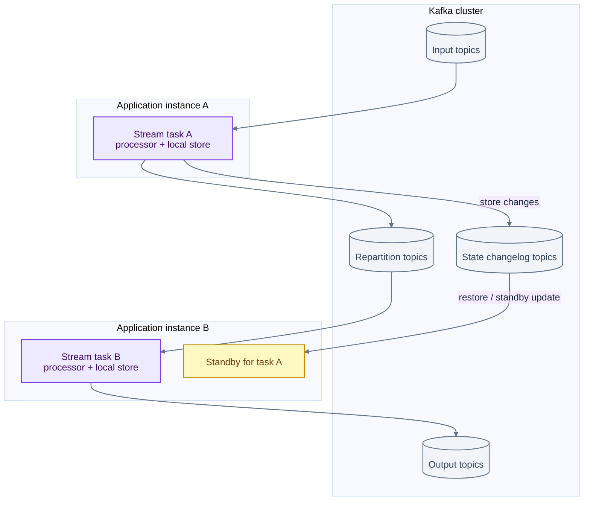
```mermaid
%%{init: {"theme":"base","htmlLabels":false,"themeVariables":{"fontFamily":"Ubuntu, Arial, sans-serif","fontSize":"17px","primaryTextColor":"#142337","lineColor":"#718096","actorBkg":"#eaf2fa","actorBorder":"#53728c","actorTextColor":"#142337","signalColor":"#526479","signalTextColor":"#142337","noteBkgColor":"#fff7d6","noteTextColor":"#423511"},"flowchart":{"curve":"basis","nodeSpacing":42,"rankSpacing":65,"htmlLabels":false,"padding":20},"sequence":{"useMaxWidth":false,"actorMargin":55,"boxMargin":18,"messageMargin":34,"noteMargin":16,"diagramMarginX":24,"diagramMarginY":24,"wrap":true,"width":175}}}%%
flowchart TB

subgraph broker["Kafka cluster"]
 I[("Input topics")]:::store
 R[("Repartition topics")]:::store
 C[("State changelog topics")]:::store
 O[("Output topics")]:::store
end
subgraph a["Application instance A"]
 T["Stream task A
processor + local store"]:::runtime
end
subgraph b["Application instance B"]
 U["Stream task B
processor + local store"]:::runtime
 S["Standby for task A"]:::state
end
 I --> T
 T --> R
 R --> U
 T -->|"store changes"| C
 C -->|"restore / standby update"| S
 U --> O

classDef control fill:#e0f2fe,stroke:#0284c7,color:#0c4a6e,stroke-width:1.6px
classDef worker fill:#dcfce7,stroke:#16a34a,color:#14532d,stroke-width:1.6px
classDef runtime fill:#ede9fe,stroke:#7c3aed,color:#3b0764,stroke-width:1.6px
classDef io fill:#ffedd5,stroke:#f97316,color:#7c2d12,stroke-width:1.6px
classDef state fill:#fef9c3,stroke:#ca8a04,color:#713f12,stroke-width:1.6px
classDef store fill:#f1f5f9,stroke:#64748b,color:#334155,stroke-width:1.6px
classDef fail fill:#fee2e2,stroke:#dc2626,color:#7f1d1d,stroke-width:1.6px
linkStyle default stroke:#64748b,stroke-width:1.6px,stroke-linecap:round

```

## Successful task commit

The changelog and output share the Kafka transaction. The local store remains an execution cache / state representation whose recovery follows the committed history.

Source references: streams-commit, streams-state.

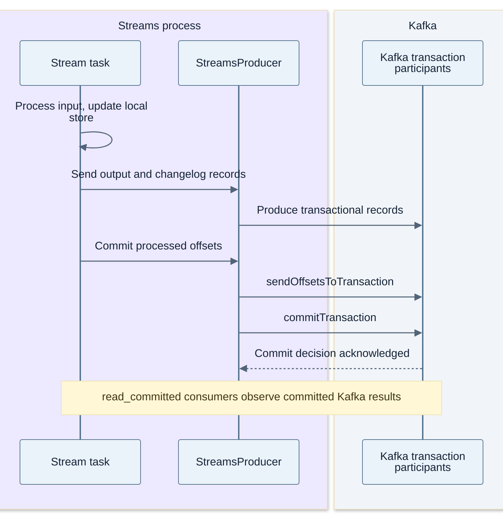
```mermaid
%%{init: {"theme":"base","htmlLabels":false,"themeVariables":{"fontFamily":"Ubuntu, Arial, sans-serif","fontSize":"17px","primaryTextColor":"#142337","lineColor":"#718096","actorBkg":"#eaf2fa","actorBorder":"#53728c","actorTextColor":"#142337","signalColor":"#526479","signalTextColor":"#142337","noteBkgColor":"#fff7d6","noteTextColor":"#423511"},"flowchart":{"curve":"basis","nodeSpacing":42,"rankSpacing":65,"htmlLabels":false,"padding":20},"sequence":{"useMaxWidth":false,"actorMargin":55,"boxMargin":18,"messageMargin":34,"noteMargin":16,"diagramMarginX":24,"diagramMarginY":24,"wrap":true,"width":175}}}%%
sequenceDiagram

box rgb(237,233,254) Streams process
 participant T as Stream task
 participant P as StreamsProducer
end
box rgb(241,245,249) Kafka
 participant K as Kafka transaction participants
end
 T->>T: Process input, update local store
 T->>P: Send output and changelog records
 P->>K: Produce transactional records
 T->>P: Commit processed offsets
 P->>K: sendOffsetsToTransaction
 P->>K: commitTransaction
 K-->>P: Commit decision acknowledged
 Note over T,K: read_committed consumers observe committed Kafka results
```

## Task takeover after instance loss

Standby promotion or changelog replay reconstructs state; fencing protects against the old instance continuing to commit.

Source references: streams-restore, streams-state, streams-commit.

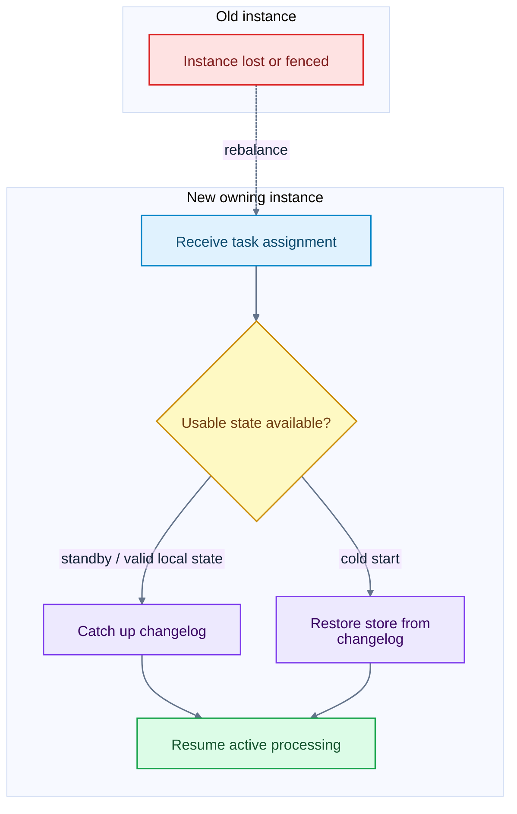
```mermaid
%%{init: {"theme":"base","htmlLabels":false,"themeVariables":{"fontFamily":"Ubuntu, Arial, sans-serif","fontSize":"17px","primaryTextColor":"#142337","lineColor":"#718096","actorBkg":"#eaf2fa","actorBorder":"#53728c","actorTextColor":"#142337","signalColor":"#526479","signalTextColor":"#142337","noteBkgColor":"#fff7d6","noteTextColor":"#423511"},"flowchart":{"curve":"basis","nodeSpacing":42,"rankSpacing":65,"htmlLabels":false,"padding":20},"sequence":{"useMaxWidth":false,"actorMargin":55,"boxMargin":18,"messageMargin":34,"noteMargin":16,"diagramMarginX":24,"diagramMarginY":24,"wrap":true,"width":175}}}%%
flowchart TB

subgraph failure["Old instance"]
 X["Instance lost or fenced"]:::fail
end
subgraph recovery["New owning instance"]
 A["Receive task assignment"]:::control --> Q{"Usable state available?"}:::state
 Q -->|"standby / valid local state"| W["Catch up changelog"]:::runtime
 Q -->|"cold start"| R["Restore store from changelog"]:::runtime
 W --> P["Resume active processing"]:::worker
 R --> P
end
 X -. "rebalance" .-> A

classDef control fill:#e0f2fe,stroke:#0284c7,color:#0c4a6e,stroke-width:1.6px
classDef worker fill:#dcfce7,stroke:#16a34a,color:#14532d,stroke-width:1.6px
classDef runtime fill:#ede9fe,stroke:#7c3aed,color:#3b0764,stroke-width:1.6px
classDef io fill:#ffedd5,stroke:#f97316,color:#7c2d12,stroke-width:1.6px
classDef state fill:#fef9c3,stroke:#ca8a04,color:#713f12,stroke-width:1.6px
classDef store fill:#f1f5f9,stroke:#64748b,color:#334155,stroke-width:1.6px
classDef fail fill:#fee2e2,stroke:#dc2626,color:#7f1d1d,stroke-width:1.6px
linkStyle default stroke:#64748b,stroke-width:1.6px,stroke-linecap:round

```

## Management and record paths

Workers coordinate through Kafka membership and backing topics. External records do not flow through the REST endpoint.

Source references: connect-group, connect-sink.

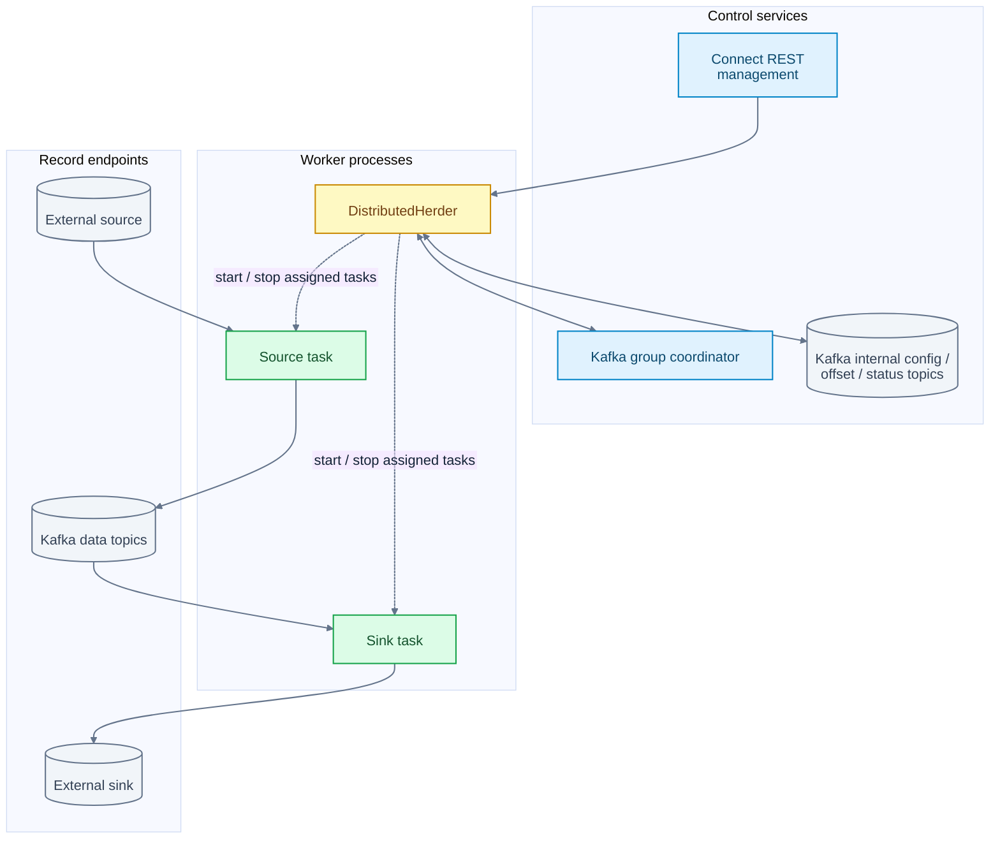
```mermaid
%%{init: {"theme":"base","htmlLabels":false,"themeVariables":{"fontFamily":"Ubuntu, Arial, sans-serif","fontSize":"17px","primaryTextColor":"#142337","lineColor":"#718096","actorBkg":"#eaf2fa","actorBorder":"#53728c","actorTextColor":"#142337","signalColor":"#526479","signalTextColor":"#142337","noteBkgColor":"#fff7d6","noteTextColor":"#423511"},"flowchart":{"curve":"basis","nodeSpacing":42,"rankSpacing":65,"htmlLabels":false,"padding":20},"sequence":{"useMaxWidth":false,"actorMargin":55,"boxMargin":18,"messageMargin":34,"noteMargin":16,"diagramMarginX":24,"diagramMarginY":24,"wrap":true,"width":175}}}%%
flowchart TB

subgraph management["Control services"]
 R["Connect REST management"]:::control
 K[("Kafka internal config / offset / status topics")]:::store
 G["Kafka group coordinator"]:::control
end
subgraph workers["Worker processes"]
 H["DistributedHerder"]:::state
 S["Source task"]:::worker
 T["Sink task"]:::worker
 H -. "start / stop assigned tasks" .-> S
 H -. "start / stop assigned tasks" .-> T
end
subgraph external["Record endpoints"]
 DB[("External source")]:::store
 TOP[("Kafka data topics")]:::store
 OUT[("External sink")]:::store
end
 R --> H
 H <--> G
 H <--> K
 DB --> S --> TOP --> T --> OUT

classDef control fill:#e0f2fe,stroke:#0284c7,color:#0c4a6e,stroke-width:1.6px
classDef worker fill:#dcfce7,stroke:#16a34a,color:#14532d,stroke-width:1.6px
classDef runtime fill:#ede9fe,stroke:#7c3aed,color:#3b0764,stroke-width:1.6px
classDef io fill:#ffedd5,stroke:#f97316,color:#7c2d12,stroke-width:1.6px
classDef state fill:#fef9c3,stroke:#ca8a04,color:#713f12,stroke-width:1.6px
classDef store fill:#f1f5f9,stroke:#64748b,color:#334155,stroke-width:1.6px
classDef fail fill:#fee2e2,stroke:#dc2626,color:#7f1d1d,stroke-width:1.6px
linkStyle default stroke:#64748b,stroke-width:1.6px,stroke-linecap:round

```

## Connect exactly-once source commit

The external source is read, not transactionally mutated by this protocol. Source-offset records and Kafka output share the transactional producer.

Source references: connect-source-eos.

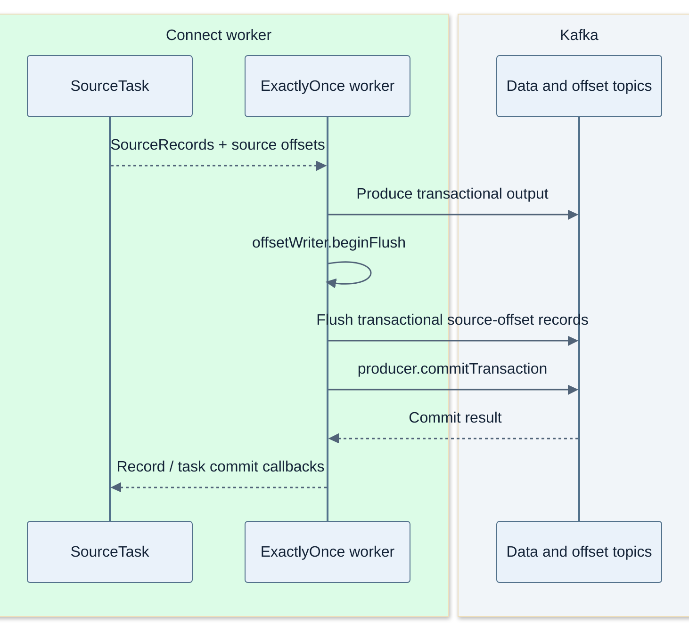
```mermaid
%%{init: {"theme":"base","htmlLabels":false,"themeVariables":{"fontFamily":"Ubuntu, Arial, sans-serif","fontSize":"17px","primaryTextColor":"#142337","lineColor":"#718096","actorBkg":"#eaf2fa","actorBorder":"#53728c","actorTextColor":"#142337","signalColor":"#526479","signalTextColor":"#142337","noteBkgColor":"#fff7d6","noteTextColor":"#423511"},"flowchart":{"curve":"basis","nodeSpacing":42,"rankSpacing":65,"htmlLabels":false,"padding":20},"sequence":{"useMaxWidth":false,"actorMargin":55,"boxMargin":18,"messageMargin":34,"noteMargin":16,"diagramMarginX":24,"diagramMarginY":24,"wrap":true,"width":175}}}%%
sequenceDiagram

box rgb(220,252,231) Connect worker
 participant S as SourceTask
 participant W as ExactlyOnce worker
end
box rgb(241,245,249) Kafka
 participant K as Data and offset topics
end
 S-->>W: SourceRecords + source offsets
 W->>K: Produce transactional output
 W->>W: offsetWriter.beginFlush
 W->>K: Flush transactional source-offset records
 W->>K: producer.commitTransaction
 K-->>W: Commit result
 W-->>S: Record / task commit callbacks
```

## A sink side effect can precede offset commit

A process crash in the highlighted gap permits replay. A destination idempotency key can make it harmless.

Source references: connect-sink, connect-precommit.

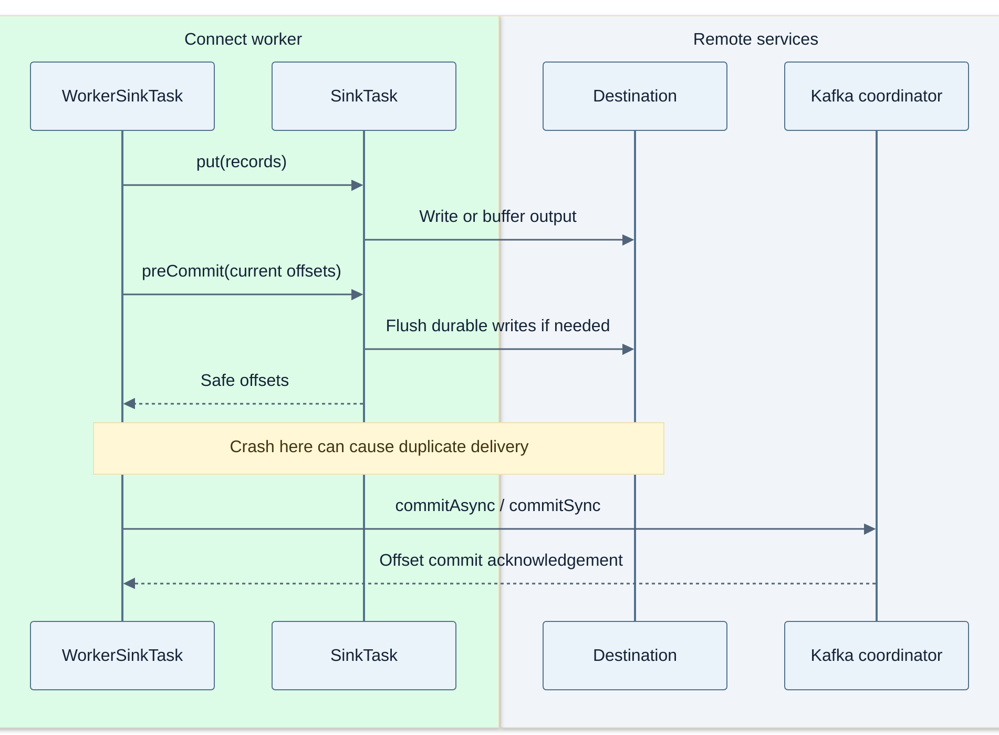
```mermaid
%%{init: {"theme":"base","htmlLabels":false,"themeVariables":{"fontFamily":"Ubuntu, Arial, sans-serif","fontSize":"17px","primaryTextColor":"#142337","lineColor":"#718096","actorBkg":"#eaf2fa","actorBorder":"#53728c","actorTextColor":"#142337","signalColor":"#526479","signalTextColor":"#142337","noteBkgColor":"#fff7d6","noteTextColor":"#423511"},"flowchart":{"curve":"basis","nodeSpacing":42,"rankSpacing":65,"htmlLabels":false,"padding":20},"sequence":{"useMaxWidth":false,"actorMargin":55,"boxMargin":18,"messageMargin":34,"noteMargin":16,"diagramMarginX":24,"diagramMarginY":24,"wrap":true,"width":175}}}%%
sequenceDiagram

box rgb(220,252,231) Connect worker
 participant W as WorkerSinkTask
 participant T as SinkTask
end
box rgb(241,245,249) Remote services
 participant D as Destination
 participant K as Kafka coordinator
end
 W->>T: put(records)
 T->>D: Write or buffer output
 W->>T: preCommit(current offsets)
 T->>D: Flush durable writes if needed
 T-->>W: Safe offsets
 Note over W,D: Crash here can cause duplicate delivery
 W->>K: commitAsync / commitSync
 K-->>W: Offset commit acknowledgement
```

## Flink process boundaries

Worker resource allocation and per-job scheduling are separate responsibilities. Deployment mode determines whether jobs share these cluster services.

Source references: flink-deploy, flink-checkpoint, flink-network.

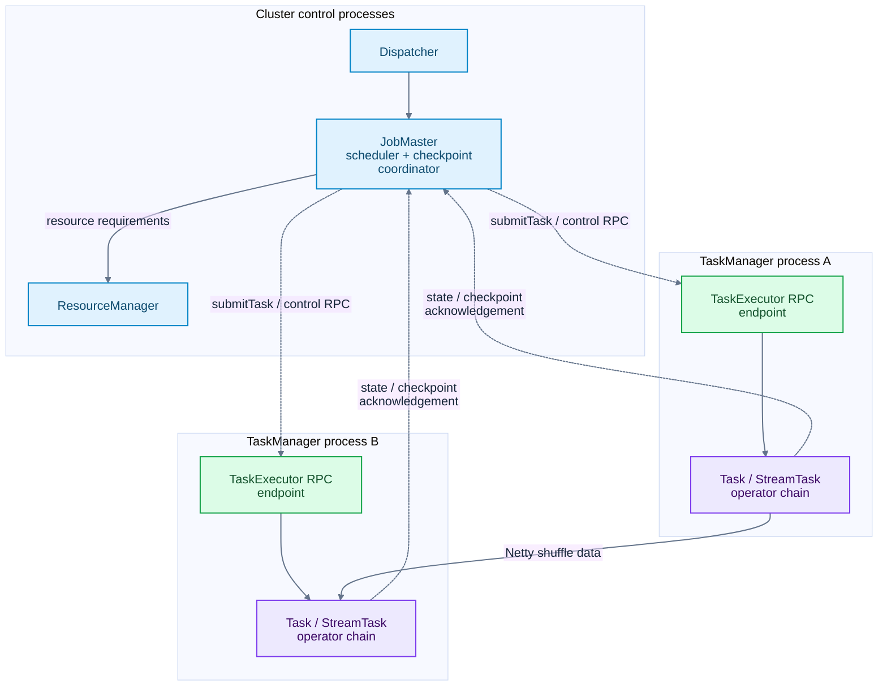
```mermaid
%%{init: {"theme":"base","htmlLabels":false,"themeVariables":{"fontFamily":"Ubuntu, Arial, sans-serif","fontSize":"17px","primaryTextColor":"#142337","lineColor":"#718096","actorBkg":"#eaf2fa","actorBorder":"#53728c","actorTextColor":"#142337","signalColor":"#526479","signalTextColor":"#142337","noteBkgColor":"#fff7d6","noteTextColor":"#423511"},"flowchart":{"curve":"basis","nodeSpacing":42,"rankSpacing":65,"htmlLabels":false,"padding":20},"sequence":{"useMaxWidth":false,"actorMargin":55,"boxMargin":18,"messageMargin":34,"noteMargin":16,"diagramMarginX":24,"diagramMarginY":24,"wrap":true,"width":175}}}%%
flowchart TB

subgraph control["Cluster control processes"]
 D["Dispatcher"]:::control
 R["ResourceManager"]:::control
 J["JobMaster
scheduler + checkpoint coordinator"]:::control
 D --> J
 J -->|"resource requirements"| R
end
subgraph workerA["TaskManager process A"]
 A["TaskExecutor RPC endpoint"]:::worker
 T["Task / StreamTask
operator chain"]:::runtime
 A --> T
end
subgraph workerB["TaskManager process B"]
 B["TaskExecutor RPC endpoint"]:::worker
 U["Task / StreamTask
operator chain"]:::runtime
 B --> U
end
 J -. "submitTask / control RPC" .-> A
 J -. "submitTask / control RPC" .-> B
 T -->|"Netty shuffle data"| U
 T -. "state / checkpoint acknowledgement" .-> J
 U -. "state / checkpoint acknowledgement" .-> J

classDef control fill:#e0f2fe,stroke:#0284c7,color:#0c4a6e,stroke-width:1.6px
classDef worker fill:#dcfce7,stroke:#16a34a,color:#14532d,stroke-width:1.6px
classDef runtime fill:#ede9fe,stroke:#7c3aed,color:#3b0764,stroke-width:1.6px
classDef io fill:#ffedd5,stroke:#f97316,color:#7c2d12,stroke-width:1.6px
classDef state fill:#fef9c3,stroke:#ca8a04,color:#713f12,stroke-width:1.6px
classDef store fill:#f1f5f9,stroke:#64748b,color:#334155,stroke-width:1.6px
classDef fail fill:#fee2e2,stroke:#dc2626,color:#7f1d1d,stroke-width:1.6px
linkStyle default stroke:#64748b,stroke-width:1.6px,stroke-linecap:round

```

## Resource allocation before deployment

This is the connected-worker path. Worker provisioning, registration and retry messages are omitted; a requested slot must still be accepted by the job slot pool.

Source references: flink-requirements, flink-slot-request, flink-slot-offer.

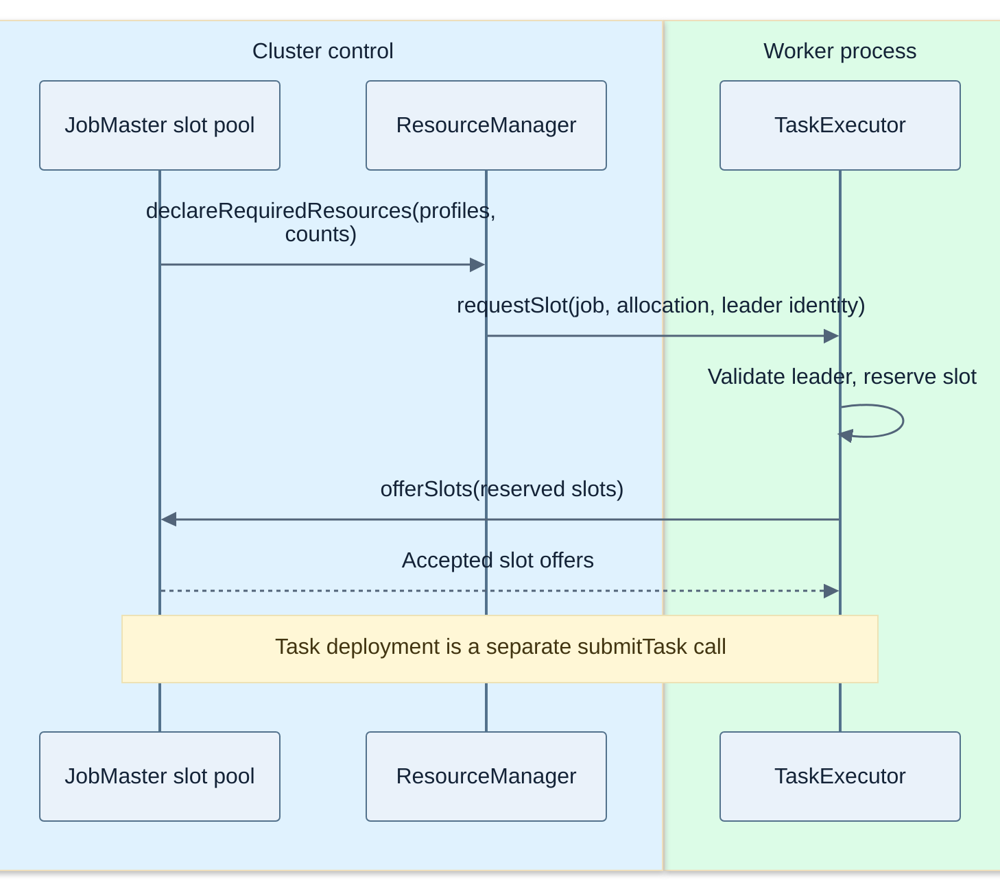
```mermaid
%%{init: {"theme":"base","htmlLabels":false,"themeVariables":{"fontFamily":"Ubuntu, Arial, sans-serif","fontSize":"17px","primaryTextColor":"#142337","lineColor":"#718096","actorBkg":"#eaf2fa","actorBorder":"#53728c","actorTextColor":"#142337","signalColor":"#526479","signalTextColor":"#142337","noteBkgColor":"#fff7d6","noteTextColor":"#423511"},"flowchart":{"curve":"basis","nodeSpacing":42,"rankSpacing":65,"htmlLabels":false,"padding":20},"sequence":{"useMaxWidth":false,"actorMargin":55,"boxMargin":18,"messageMargin":34,"noteMargin":16,"diagramMarginX":24,"diagramMarginY":24,"wrap":true,"width":175}}}%%
sequenceDiagram

box rgb(224,242,254) Cluster control
 participant J as JobMaster slot pool
 participant R as ResourceManager
end
box rgb(220,252,231) Worker process
 participant T as TaskExecutor
end
 J->>R: declareRequiredResources(profiles, counts)
 R->>T: requestSlot(job, allocation, leader identity)
 T->>T: Validate leader, reserve slot
 T->>J: offerSlots(reserved slots)
 J-->>T: Accepted slot offers
 Note over J,T: Task deployment is a separate submitTask call
```

## A task starts on a worker

The task descriptor crosses RPC; subsequent operator processing runs inside the worker.

Source references: flink-deploy.

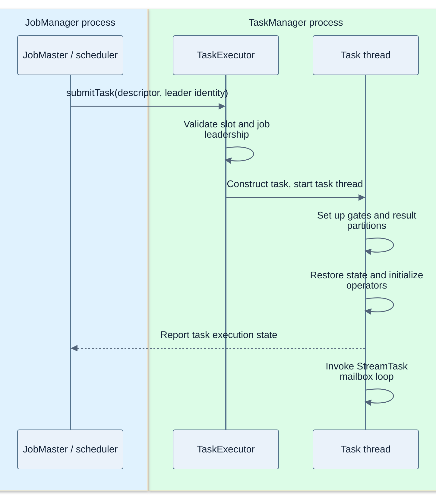
```mermaid
%%{init: {"theme":"base","htmlLabels":false,"themeVariables":{"fontFamily":"Ubuntu, Arial, sans-serif","fontSize":"17px","primaryTextColor":"#142337","lineColor":"#718096","actorBkg":"#eaf2fa","actorBorder":"#53728c","actorTextColor":"#142337","signalColor":"#526479","signalTextColor":"#142337","noteBkgColor":"#fff7d6","noteTextColor":"#423511"},"flowchart":{"curve":"basis","nodeSpacing":42,"rankSpacing":65,"htmlLabels":false,"padding":20},"sequence":{"useMaxWidth":false,"actorMargin":55,"boxMargin":18,"messageMargin":34,"noteMargin":16,"diagramMarginX":24,"diagramMarginY":24,"wrap":true,"width":175}}}%%
sequenceDiagram

box rgb(224,242,254) JobManager process
 participant J as JobMaster / scheduler
end
box rgb(220,252,231) TaskManager process
 participant E as TaskExecutor
 participant T as Task thread
end
 J->>E: submitTask(descriptor, leader identity)
 E->>E: Validate slot and job leadership
 E->>T: Construct task, start task thread
 T->>T: Set up gates and result partitions
 T->>T: Restore state and initialize operators
 T-->>J: Report task execution state
 T->>T: Invoke StreamTask mailbox loop
```

## Logical intent becomes retryable attempts

Each step adds a different kind of execution information.

Source references: flink-graph, flink-deploy.

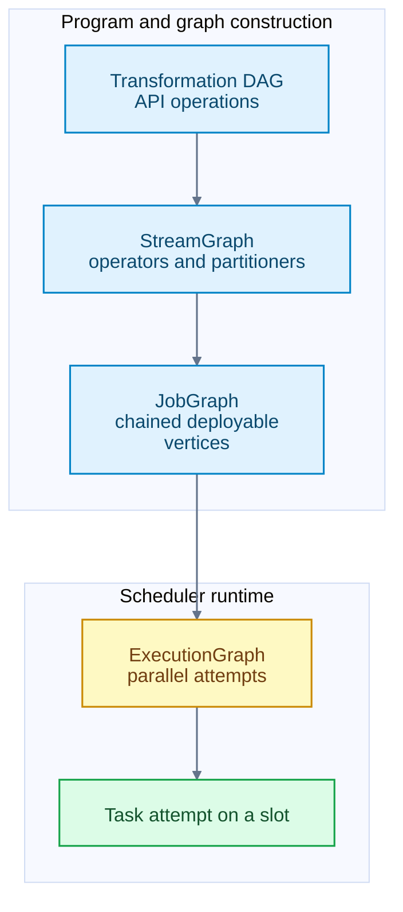
```mermaid
%%{init: {"theme":"base","htmlLabels":false,"themeVariables":{"fontFamily":"Ubuntu, Arial, sans-serif","fontSize":"17px","primaryTextColor":"#142337","lineColor":"#718096","actorBkg":"#eaf2fa","actorBorder":"#53728c","actorTextColor":"#142337","signalColor":"#526479","signalTextColor":"#142337","noteBkgColor":"#fff7d6","noteTextColor":"#423511"},"flowchart":{"curve":"basis","nodeSpacing":42,"rankSpacing":65,"htmlLabels":false,"padding":20},"sequence":{"useMaxWidth":false,"actorMargin":55,"boxMargin":18,"messageMargin":34,"noteMargin":16,"diagramMarginX":24,"diagramMarginY":24,"wrap":true,"width":175}}}%%
flowchart TB

subgraph compile["Program and graph construction"]
 T["Transformation DAG
API operations"]:::control --> S["StreamGraph
operators and partitioners"]:::control
 S --> J["JobGraph
chained deployable vertices"]:::control
end
subgraph schedule["Scheduler runtime"]
 J --> E["ExecutionGraph
parallel attempts"]:::state
 E --> A["Task attempt on a slot"]:::worker
end

classDef control fill:#e0f2fe,stroke:#0284c7,color:#0c4a6e,stroke-width:1.6px
classDef worker fill:#dcfce7,stroke:#16a34a,color:#14532d,stroke-width:1.6px
classDef runtime fill:#ede9fe,stroke:#7c3aed,color:#3b0764,stroke-width:1.6px
classDef io fill:#ffedd5,stroke:#f97316,color:#7c2d12,stroke-width:1.6px
classDef state fill:#fef9c3,stroke:#ca8a04,color:#713f12,stroke-width:1.6px
classDef store fill:#f1f5f9,stroke:#64748b,color:#334155,stroke-width:1.6px
classDef fail fill:#fee2e2,stroke:#dc2626,color:#7f1d1d,stroke-width:1.6px
linkStyle default stroke:#64748b,stroke-width:1.6px,stroke-linecap:round

```

## One keyBy creates a physical boundary

Source and map may be chained. The downstream keyed operator owns a different key-group range and receives shuffled data.

Source references: flink-graph, flink-keygroup, flink-network.

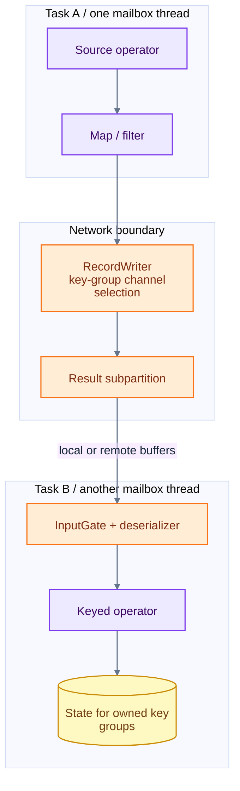
```mermaid
%%{init: {"theme":"base","htmlLabels":false,"themeVariables":{"fontFamily":"Ubuntu, Arial, sans-serif","fontSize":"17px","primaryTextColor":"#142337","lineColor":"#718096","actorBkg":"#eaf2fa","actorBorder":"#53728c","actorTextColor":"#142337","signalColor":"#526479","signalTextColor":"#142337","noteBkgColor":"#fff7d6","noteTextColor":"#423511"},"flowchart":{"curve":"basis","nodeSpacing":42,"rankSpacing":65,"htmlLabels":false,"padding":20},"sequence":{"useMaxWidth":false,"actorMargin":55,"boxMargin":18,"messageMargin":34,"noteMargin":16,"diagramMarginX":24,"diagramMarginY":24,"wrap":true,"width":175}}}%%
flowchart TB

subgraph taskA["Task A / one mailbox thread"]
 S["Source operator"]:::runtime --> M["Map / filter"]:::runtime
end
subgraph exchange["Network boundary"]
 W["RecordWriter
key-group channel selection"]:::io --> R["Result subpartition"]:::io
end
subgraph taskB["Task B / another mailbox thread"]
 G["InputGate + deserializer"]:::io --> O["Keyed operator"]:::runtime
 O --> ST[("State for owned key groups")]:::state
end
 M --> W
 R -->|"local or remote buffers"| G

classDef control fill:#e0f2fe,stroke:#0284c7,color:#0c4a6e,stroke-width:1.6px
classDef worker fill:#dcfce7,stroke:#16a34a,color:#14532d,stroke-width:1.6px
classDef runtime fill:#ede9fe,stroke:#7c3aed,color:#3b0764,stroke-width:1.6px
classDef io fill:#ffedd5,stroke:#f97316,color:#7c2d12,stroke-width:1.6px
classDef state fill:#fef9c3,stroke:#ca8a04,color:#713f12,stroke-width:1.6px
classDef store fill:#f1f5f9,stroke:#64748b,color:#334155,stroke-width:1.6px
classDef fail fill:#fee2e2,stroke:#dc2626,color:#7f1d1d,stroke-width:1.6px
linkStyle default stroke:#64748b,stroke-width:1.6px,stroke-linecap:round

```

## I/O ownership differs from state ownership

The record emitter updates source progress in the task path after emission. Prefetched records can still be replayed.

Source references: flink-mailbox, fk-fetch, fk-emit.

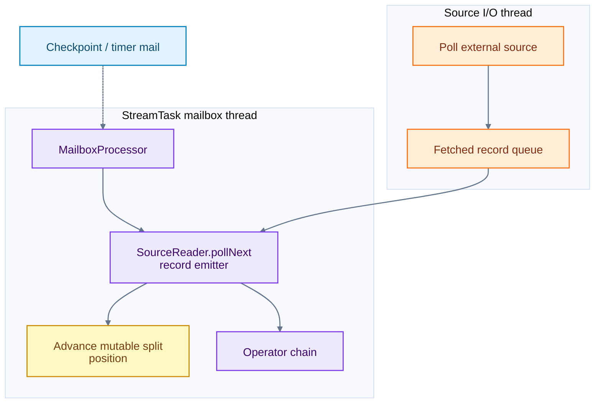
```mermaid
%%{init: {"theme":"base","htmlLabels":false,"themeVariables":{"fontFamily":"Ubuntu, Arial, sans-serif","fontSize":"17px","primaryTextColor":"#142337","lineColor":"#718096","actorBkg":"#eaf2fa","actorBorder":"#53728c","actorTextColor":"#142337","signalColor":"#526479","signalTextColor":"#142337","noteBkgColor":"#fff7d6","noteTextColor":"#423511"},"flowchart":{"curve":"basis","nodeSpacing":42,"rankSpacing":65,"htmlLabels":false,"padding":20},"sequence":{"useMaxWidth":false,"actorMargin":55,"boxMargin":18,"messageMargin":34,"noteMargin":16,"diagramMarginX":24,"diagramMarginY":24,"wrap":true,"width":175}}}%%
flowchart TB

subgraph fetcher["Source I/O thread"]
 P["Poll external source"]:::io --> Q["Fetched record queue"]:::io
end
subgraph task["StreamTask mailbox thread"]
 M["MailboxProcessor"]:::runtime --> E["SourceReader.pollNext
record emitter"]:::runtime
 E --> S["Advance mutable split position"]:::state
 E --> O["Operator chain"]:::runtime
end
 Q --> E
 C["Checkpoint / timer mail"]:::control -.-> M

classDef control fill:#e0f2fe,stroke:#0284c7,color:#0c4a6e,stroke-width:1.6px
classDef worker fill:#dcfce7,stroke:#16a34a,color:#14532d,stroke-width:1.6px
classDef runtime fill:#ede9fe,stroke:#7c3aed,color:#3b0764,stroke-width:1.6px
classDef io fill:#ffedd5,stroke:#f97316,color:#7c2d12,stroke-width:1.6px
classDef state fill:#fef9c3,stroke:#ca8a04,color:#713f12,stroke-width:1.6px
classDef store fill:#f1f5f9,stroke:#64748b,color:#334155,stroke-width:1.6px
classDef fail fill:#fee2e2,stroke:#dc2626,color:#7f1d1d,stroke-width:1.6px
linkStyle default stroke:#64748b,stroke-width:1.6px,stroke-linecap:round

```

## Remote shuffle credit cycle

This is the data transport between TaskManagers, separate from JobMaster task-control RPC.

Source references: flink-network, flink-input.

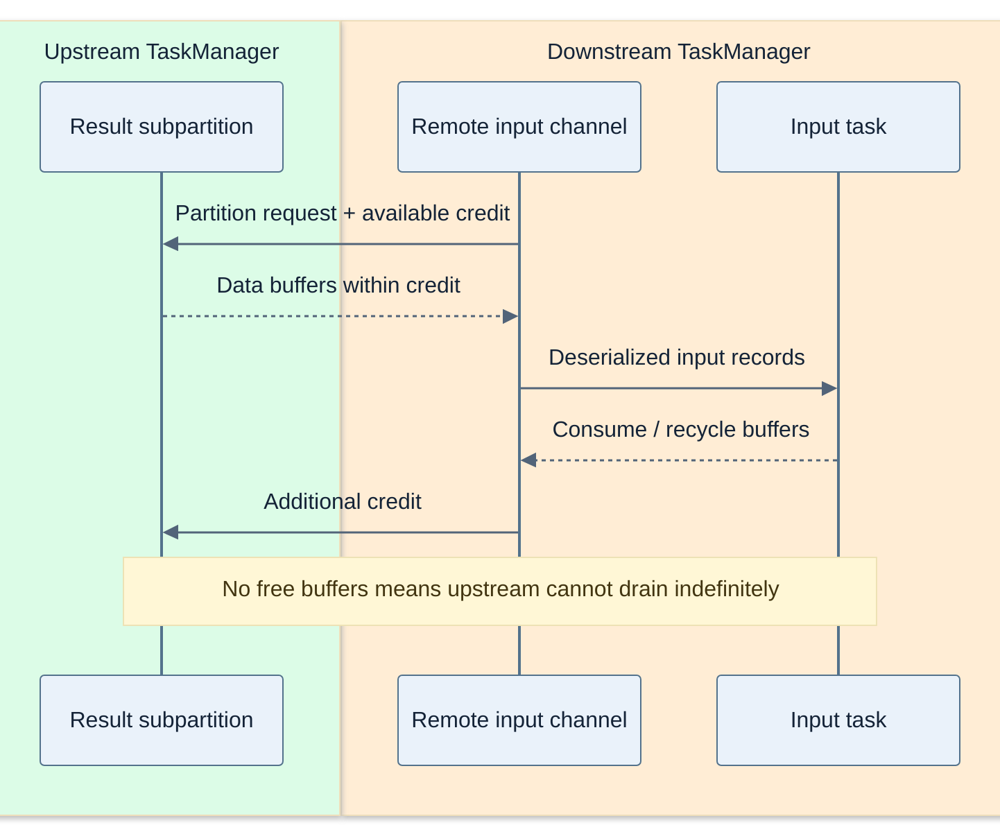
```mermaid
%%{init: {"theme":"base","htmlLabels":false,"themeVariables":{"fontFamily":"Ubuntu, Arial, sans-serif","fontSize":"17px","primaryTextColor":"#142337","lineColor":"#718096","actorBkg":"#eaf2fa","actorBorder":"#53728c","actorTextColor":"#142337","signalColor":"#526479","signalTextColor":"#142337","noteBkgColor":"#fff7d6","noteTextColor":"#423511"},"flowchart":{"curve":"basis","nodeSpacing":42,"rankSpacing":65,"htmlLabels":false,"padding":20},"sequence":{"useMaxWidth":false,"actorMargin":55,"boxMargin":18,"messageMargin":34,"noteMargin":16,"diagramMarginX":24,"diagramMarginY":24,"wrap":true,"width":175}}}%%
sequenceDiagram

box rgb(220,252,231) Upstream TaskManager
 participant P as Result subpartition
end
box rgb(255,237,213) Downstream TaskManager
 participant C as Remote input channel
 participant T as Input task
end
 C->>P: Partition request + available credit
 P-->>C: Data buffers within credit
 C->>T: Deserialized input records
 T-->>C: Consume / recycle buffers
 C->>P: Additional credit
 Note over P,T: No free buffers means upstream cannot drain indefinitely
```

## Two active inputs bound event time

For A=100 and B=80, the combined frontier is 80. Correctly marking B idle removes it from the active minimum.

Source references: flink-watermark.

```mermaid
%%{init: {"theme":"base","htmlLabels":false,"themeVariables":{"fontFamily":"Ubuntu, Arial, sans-serif","fontSize":"17px","primaryTextColor":"#142337","lineColor":"#718096","actorBkg":"#eaf2fa","actorBorder":"#53728c","actorTextColor":"#142337","signalColor":"#526479","signalTextColor":"#142337","noteBkgColor":"#fff7d6","noteTextColor":"#423511"},"flowchart":{"curve":"basis","nodeSpacing":42,"rankSpacing":65,"htmlLabels":false,"padding":20},"sequence":{"useMaxWidth":false,"actorMargin":55,"boxMargin":18,"messageMargin":34,"noteMargin":16,"diagramMarginX":24,"diagramMarginY":24,"wrap":true,"width":175}}}%%
flowchart TB

subgraph inputs["Input channel progress"]
 A["A: watermark 100"]:::io
 B["B: watermark 80"]:::io
end
subgraph operator["Operator event-time path"]
 V["StatusWatermarkValve
active aligned minimum = 80"]:::state
 T["Advance event-time timers"]:::runtime
 O["Forward watermark 80"]:::runtime
 V --> T --> O
end
 A --> V
 B --> V

classDef control fill:#e0f2fe,stroke:#0284c7,color:#0c4a6e,stroke-width:1.6px
classDef worker fill:#dcfce7,stroke:#16a34a,color:#14532d,stroke-width:1.6px
classDef runtime fill:#ede9fe,stroke:#7c3aed,color:#3b0764,stroke-width:1.6px
classDef io fill:#ffedd5,stroke:#f97316,color:#7c2d12,stroke-width:1.6px
classDef state fill:#fef9c3,stroke:#ca8a04,color:#713f12,stroke-width:1.6px
classDef store fill:#f1f5f9,stroke:#64748b,color:#334155,stroke-width:1.6px
classDef fail fill:#fee2e2,stroke:#dc2626,color:#7f1d1d,stroke-width:1.6px
linkStyle default stroke:#64748b,stroke-width:1.6px,stroke-linecap:round

```

## Trigger acceptance, state acknowledgement and sink commit

The three acknowledgements have different meanings. The durable checkpoint store is represented inside the coordinator lane.

Source references: flink-barrier, flink-checkpoint.

```mermaid
%%{init: {"theme":"base","htmlLabels":false,"themeVariables":{"fontFamily":"Ubuntu, Arial, sans-serif","fontSize":"17px","primaryTextColor":"#142337","lineColor":"#718096","actorBkg":"#eaf2fa","actorBorder":"#53728c","actorTextColor":"#142337","signalColor":"#526479","signalTextColor":"#142337","noteBkgColor":"#fff7d6","noteTextColor":"#423511"},"flowchart":{"curve":"basis","nodeSpacing":42,"rankSpacing":65,"htmlLabels":false,"padding":20},"sequence":{"useMaxWidth":false,"actorMargin":55,"boxMargin":18,"messageMargin":34,"noteMargin":16,"diagramMarginX":24,"diagramMarginY":24,"wrap":true,"width":175}}}%%
sequenceDiagram

box rgb(224,242,254) JobManager
 participant J as Checkpoint coordinator
end
box rgb(220,252,231) TaskManager
 participant T as Task / mailbox
 participant A as Async snapshot worker
end
box rgb(241,245,249) Storage
 participant S as Checkpoint storage
end
 J->>T: triggerCheckpoint(CP42)
 T-->>J: Trigger accepted
 T->>T: Pre-barrier sink preparation
 T->>T: Broadcast barrier, snapshot operators
 T->>A: Materialize snapshot futures
 A->>S: Persist state
 S-->>A: Durable state handles
 A-->>J: AcknowledgeCheckpoint(CP42, handles)
 J->>J: All required ACKs, store completed CP42
 J-->>T: notifyCheckpointComplete(CP42)
 T->>T: Invoke checkpoint-aware sink commit
```

## Checkpoint mode chooses where the waiting cost goes

Both modes preserve a recovery cut when used correctly. Unaligned does not remove checkpoint storage bandwidth limits.

Source references: flink-barrier, flink-checkpoint.

```mermaid
%%{init: {"theme":"base","htmlLabels":false,"themeVariables":{"fontFamily":"Ubuntu, Arial, sans-serif","fontSize":"17px","primaryTextColor":"#142337","lineColor":"#718096","actorBkg":"#eaf2fa","actorBorder":"#53728c","actorTextColor":"#142337","signalColor":"#526479","signalTextColor":"#142337","noteBkgColor":"#fff7d6","noteTextColor":"#423511"},"flowchart":{"curve":"basis","nodeSpacing":42,"rankSpacing":65,"htmlLabels":false,"padding":20},"sequence":{"useMaxWidth":false,"actorMargin":55,"boxMargin":18,"messageMargin":34,"noteMargin":16,"diagramMarginX":24,"diagramMarginY":24,"wrap":true,"width":175}}}%%
flowchart TB

subgraph arrival["Multi-input task"]
 B["First checkpoint barrier"]:::io --> Q{"Checkpoint mode?"}:::state
end
subgraph aligned["Aligned"]
 A["Block post-barrier channel"]:::runtime --> W["Wait for remaining barriers"]:::runtime
 W --> AS[("Operator state snapshot")]:::store
end
subgraph unaligned["Unaligned"]
 U["Capture in-flight channel data"]:::runtime --> US[("Operator + channel state")]:::store
end
 Q -->|"aligned"| A
 Q -->|"unaligned"| U

classDef control fill:#e0f2fe,stroke:#0284c7,color:#0c4a6e,stroke-width:1.6px
classDef worker fill:#dcfce7,stroke:#16a34a,color:#14532d,stroke-width:1.6px
classDef runtime fill:#ede9fe,stroke:#7c3aed,color:#3b0764,stroke-width:1.6px
classDef io fill:#ffedd5,stroke:#f97316,color:#7c2d12,stroke-width:1.6px
classDef state fill:#fef9c3,stroke:#ca8a04,color:#713f12,stroke-width:1.6px
classDef store fill:#f1f5f9,stroke:#64748b,color:#334155,stroke-width:1.6px
classDef fail fill:#fee2e2,stroke:#dc2626,color:#7f1d1d,stroke-width:1.6px
linkStyle default stroke:#64748b,stroke-width:1.6px,stroke-linecap:round

```

## Task recovery state machine

A checkpointed sink receipt can be retried after a failed attempt. The external authority decides whether it is already committed.

Source references: flink-restore, flink-checkpoint, fk-commit.

```mermaid
%%{init: {"theme":"base","htmlLabels":false,"themeVariables":{"fontFamily":"Ubuntu, Arial, sans-serif","fontSize":"17px","primaryTextColor":"#142337","lineColor":"#718096","actorBkg":"#eaf2fa","actorBorder":"#53728c","actorTextColor":"#142337","signalColor":"#526479","signalTextColor":"#142337","noteBkgColor":"#fff7d6","noteTextColor":"#423511"},"flowchart":{"curve":"basis","nodeSpacing":42,"rankSpacing":65,"htmlLabels":false,"padding":20},"sequence":{"useMaxWidth":false,"actorMargin":55,"boxMargin":18,"messageMargin":34,"noteMargin":16,"diagramMarginX":24,"diagramMarginY":24,"wrap":true,"width":175}}}%%
flowchart TB

subgraph scheduler["JobMaster recovery"]
 X["Task failure or lost worker"]:::fail --> C["Select scope; cancel attempts"]:::control
 C --> R["Restore completed checkpoint"]:::state
end
subgraph workers["Replacement attempts"]
 R --> S["Restore source / operator state"]:::worker
 R --> K["Restore sink committables"]:::worker
 S --> P["Replay input after cut"]:::runtime
 K --> D["Retry or reconcile sink commit"]:::runtime
end

classDef control fill:#e0f2fe,stroke:#0284c7,color:#0c4a6e,stroke-width:1.6px
classDef worker fill:#dcfce7,stroke:#16a34a,color:#14532d,stroke-width:1.6px
classDef runtime fill:#ede9fe,stroke:#7c3aed,color:#3b0764,stroke-width:1.6px
classDef io fill:#ffedd5,stroke:#f97316,color:#7c2d12,stroke-width:1.6px
classDef state fill:#fef9c3,stroke:#ca8a04,color:#713f12,stroke-width:1.6px
classDef store fill:#f1f5f9,stroke:#64748b,color:#334155,stroke-width:1.6px
classDef fail fill:#fee2e2,stroke:#dc2626,color:#7f1d1d,stroke-width:1.6px
linkStyle default stroke:#64748b,stroke-width:1.6px,stroke-linecap:round

```

## Record 104 becomes checkpointed next offset 105

The queue is an in-process thread handoff. The Kafka fetch is network I/O; emission and split-state mutation are task-thread work.

Source references: fk-enumerator, fk-fetch, fk-emit, fk-state.

```mermaid
%%{init: {"theme":"base","htmlLabels":false,"themeVariables":{"fontFamily":"Ubuntu, Arial, sans-serif","fontSize":"17px","primaryTextColor":"#142337","lineColor":"#718096","actorBkg":"#eaf2fa","actorBorder":"#53728c","actorTextColor":"#142337","signalColor":"#526479","signalTextColor":"#142337","noteBkgColor":"#fff7d6","noteTextColor":"#423511"},"flowchart":{"curve":"basis","nodeSpacing":42,"rankSpacing":65,"htmlLabels":false,"padding":20},"sequence":{"useMaxWidth":false,"actorMargin":55,"boxMargin":18,"messageMargin":34,"noteMargin":16,"diagramMarginX":24,"diagramMarginY":24,"wrap":true,"width":175}}}%%
sequenceDiagram

box rgb(241,245,249) Kafka broker
 participant K as Partition leader
end
box rgb(255,237,213) TaskManager fetcher thread
 participant F as Kafka split reader
end
box rgb(237,233,254) Task mailbox thread
 participant R as KafkaSourceReader / emitter
end
 F->>K: Fetch through consumer.poll
 K-->>F: Record P0 at offset 104
 F-->>R: Enqueue fetched records
 R->>R: Emit record to operator chain
 R->>R: setCurrentOffset(105)
 R->>R: snapshotState(CP42) creates split at 105
```

## CP42 stores both source progress and output transaction recovery

The two post-checkpoint Kafka operations may finish in either order. No arrow implies atomicity between them.

Source references: fk-offset, fk-writer, fk-commit.

```mermaid
%%{init: {"theme":"base","htmlLabels":false,"themeVariables":{"fontFamily":"Ubuntu, Arial, sans-serif","fontSize":"17px","primaryTextColor":"#142337","lineColor":"#718096","actorBkg":"#eaf2fa","actorBorder":"#53728c","actorTextColor":"#142337","signalColor":"#526479","signalTextColor":"#142337","noteBkgColor":"#fff7d6","noteTextColor":"#423511"},"flowchart":{"curve":"basis","nodeSpacing":42,"rankSpacing":65,"htmlLabels":false,"padding":20},"sequence":{"useMaxWidth":false,"actorMargin":55,"boxMargin":18,"messageMargin":34,"noteMargin":16,"diagramMarginX":24,"diagramMarginY":24,"wrap":true,"width":175}}}%%
flowchart TB

subgraph checkpoint["Flink durable recovery cut"]
 CP[("Completed CP42
P0 next offset 105
T42 sink receipt")]:::store
end
subgraph sink["Sink task and Kafka producer"]
 C["KafkaCommitter"]:::runtime --> T["commitTransaction T42"]:::io
 T --> M["Kafka transaction markers
read_committed visibility"]:::state
end
subgraph source["Source task and Kafka consumer"]
 S["KafkaSourceReader completion"]:::runtime --> F["Fetcher commitAsync P0=105"]:::io
 F --> O[("__consumer_offsets
external group position")]:::store
end
 CP -. "completion" .-> C
 CP -. "optional bookkeeping" .-> S

classDef control fill:#e0f2fe,stroke:#0284c7,color:#0c4a6e,stroke-width:1.6px
classDef worker fill:#dcfce7,stroke:#16a34a,color:#14532d,stroke-width:1.6px
classDef runtime fill:#ede9fe,stroke:#7c3aed,color:#3b0764,stroke-width:1.6px
classDef io fill:#ffedd5,stroke:#f97316,color:#7c2d12,stroke-width:1.6px
classDef state fill:#fef9c3,stroke:#ca8a04,color:#713f12,stroke-width:1.6px
classDef store fill:#f1f5f9,stroke:#64748b,color:#334155,stroke-width:1.6px
classDef fail fill:#fee2e2,stroke:#dc2626,color:#7f1d1d,stroke-width:1.6px
linkStyle default stroke:#64748b,stroke-width:1.6px,stroke-linecap:round

```

## Crash after checkpoint, before sink commit acknowledgement

A replacement committer resumes from the durable receipt. The exact connector transaction recovery code decides retry / fatal outcomes.

Source references: fk-commit, fk-writer.

```mermaid
%%{init: {"theme":"base","htmlLabels":false,"themeVariables":{"fontFamily":"Ubuntu, Arial, sans-serif","fontSize":"17px","primaryTextColor":"#142337","lineColor":"#718096","actorBkg":"#eaf2fa","actorBorder":"#53728c","actorTextColor":"#142337","signalColor":"#526479","signalTextColor":"#142337","noteBkgColor":"#fff7d6","noteTextColor":"#423511"},"flowchart":{"curve":"basis","nodeSpacing":42,"rankSpacing":65,"htmlLabels":false,"padding":20},"sequence":{"useMaxWidth":false,"actorMargin":55,"boxMargin":18,"messageMargin":34,"noteMargin":16,"diagramMarginX":24,"diagramMarginY":24,"wrap":true,"width":175}}}%%
sequenceDiagram

box rgb(224,242,254) Flink
 participant C as Completed checkpoint
 participant W as Committer task
end
box rgb(241,245,249) Kafka
 participant K as Transaction coordinator
end
 C-->>W: CP42 completion with T42 receipt
 W->>K: Commit T42
 Note over W,K: Task fails or response is lost
 C-->>W: Restore receipt into replacement task
 W->>K: Recover and retry commit protocol
 K-->>W: Committed result or actionable error
```

## Driver control and executor data paths

Comet, when enabled, runs inside an executor task. It does not introduce a separate native cluster scheduler.

Source references: spark-launch, spark-executor, spark-shuffle, comet-create.

```mermaid
%%{init: {"theme":"base","htmlLabels":false,"themeVariables":{"fontFamily":"Ubuntu, Arial, sans-serif","fontSize":"17px","primaryTextColor":"#142337","lineColor":"#718096","actorBkg":"#eaf2fa","actorBorder":"#53728c","actorTextColor":"#142337","signalColor":"#526479","signalTextColor":"#142337","noteBkgColor":"#fff7d6","noteTextColor":"#423511"},"flowchart":{"curve":"basis","nodeSpacing":42,"rankSpacing":65,"htmlLabels":false,"padding":20},"sequence":{"useMaxWidth":false,"actorMargin":55,"boxMargin":18,"messageMargin":34,"noteMargin":16,"diagramMarginX":24,"diagramMarginY":24,"wrap":true,"width":175}}}%%
flowchart TB

subgraph driver["Driver process"]
 D["DAGScheduler"]:::control --> T["TaskScheduler + backend"]:::control
end
subgraph e1["Executor process A"]
 A["Executor backend"]:::worker --> M["Map task
JVM or Comet native"]:::runtime
 M --> B[("Local shuffle blocks")]:::store
end
subgraph e2["Executor process B"]
 E["Executor backend"]:::worker --> R["Reduce task
JVM or Comet native"]:::runtime
end
 T -. "LaunchTask RPC" .-> A
 T -. "LaunchTask RPC" .-> E
 B -->|"block fetch network"| R
 A -. "StatusUpdate" .-> T
 E -. "StatusUpdate" .-> T

classDef control fill:#e0f2fe,stroke:#0284c7,color:#0c4a6e,stroke-width:1.6px
classDef worker fill:#dcfce7,stroke:#16a34a,color:#14532d,stroke-width:1.6px
classDef runtime fill:#ede9fe,stroke:#7c3aed,color:#3b0764,stroke-width:1.6px
classDef io fill:#ffedd5,stroke:#f97316,color:#7c2d12,stroke-width:1.6px
classDef state fill:#fef9c3,stroke:#ca8a04,color:#713f12,stroke-width:1.6px
classDef store fill:#f1f5f9,stroke:#64748b,color:#334155,stroke-width:1.6px
classDef fail fill:#fee2e2,stroke:#dc2626,color:#7f1d1d,stroke-width:1.6px
linkStyle default stroke:#64748b,stroke-width:1.6px,stroke-linecap:round

```

## A missing shuffle block causes re-execution

This is a simplified classic shuffle failure path. Newer shuffle modes can alter the retry scope.

Source references: spark-retry, spark-shuffle.

```mermaid
%%{init: {"theme":"base","htmlLabels":false,"themeVariables":{"fontFamily":"Ubuntu, Arial, sans-serif","fontSize":"17px","primaryTextColor":"#142337","lineColor":"#718096","actorBkg":"#eaf2fa","actorBorder":"#53728c","actorTextColor":"#142337","signalColor":"#526479","signalTextColor":"#142337","noteBkgColor":"#fff7d6","noteTextColor":"#423511"},"flowchart":{"curve":"basis","nodeSpacing":42,"rankSpacing":65,"htmlLabels":false,"padding":20},"sequence":{"useMaxWidth":false,"actorMargin":55,"boxMargin":18,"messageMargin":34,"noteMargin":16,"diagramMarginX":24,"diagramMarginY":24,"wrap":true,"width":175}}}%%
sequenceDiagram

box rgb(220,252,231) Executor processes
 participant R as Reduce task
 participant M as Map-output server
end
box rgb(224,242,254) Driver
 participant D as DAGScheduler
end
 R->>M: Fetch shuffle block
 M-->>R: Missing block / connection failure
 R-->>D: FetchFailed
 D->>D: Invalidate affected map output
 D->>M: Schedule replacement map attempt
 M-->>D: New output location
 D->>R: Resubmit dependent work
```

## Micro-batch 42 with Kafka input

Driver checkpoint logs and destination writes are distinct durable operations.

Source references: spark-offset, spark-end, spark-state.

```mermaid
%%{init: {"theme":"base","htmlLabels":false,"themeVariables":{"fontFamily":"Ubuntu, Arial, sans-serif","fontSize":"17px","primaryTextColor":"#142337","lineColor":"#718096","actorBkg":"#eaf2fa","actorBorder":"#53728c","actorTextColor":"#142337","signalColor":"#526479","signalTextColor":"#142337","noteBkgColor":"#fff7d6","noteTextColor":"#423511"},"flowchart":{"curve":"basis","nodeSpacing":42,"rankSpacing":65,"htmlLabels":false,"padding":20},"sequence":{"useMaxWidth":false,"actorMargin":55,"boxMargin":18,"messageMargin":34,"noteMargin":16,"diagramMarginX":24,"diagramMarginY":24,"wrap":true,"width":175}}}%%
sequenceDiagram

box rgb(224,242,254) Driver
 participant D as MicroBatchExecution
end
box rgb(241,245,249) Query storage
 participant C as Checkpoint directory
end
box rgb(220,252,231) Executors
 participant E as Batch tasks
end
box rgb(241,245,249) Destination
 participant S as Sink
end
 D->>C: Write offsets/42
 D->>E: Execute recorded input range
 E->>E: Read source, update state-store version
 E->>S: Write batch output
 E-->>D: Sink execution completes
 D->>C: Write commits/42
 Note over D,S: Crash before commits/42 can replay output
```

## One recorded range can produce twice

Both write attempts can be valid Kafka producer sessions. The missing Spark commit marker is what causes query replay.

Source references: spark-kafka, spark-offset, spark-end.

```mermaid
%%{init: {"theme":"base","htmlLabels":false,"themeVariables":{"fontFamily":"Ubuntu, Arial, sans-serif","fontSize":"17px","primaryTextColor":"#142337","lineColor":"#718096","actorBkg":"#eaf2fa","actorBorder":"#53728c","actorTextColor":"#142337","signalColor":"#526479","signalTextColor":"#142337","noteBkgColor":"#fff7d6","noteTextColor":"#423511"},"flowchart":{"curve":"basis","nodeSpacing":42,"rankSpacing":65,"htmlLabels":false,"padding":20},"sequence":{"useMaxWidth":false,"actorMargin":55,"boxMargin":18,"messageMargin":34,"noteMargin":16,"diagramMarginX":24,"diagramMarginY":24,"wrap":true,"width":175}}}%%
flowchart TB

subgraph checkpoint["Durable query checkpoint"]
 O[("offsets/42 exists
commits/42 absent")]:::state
end
subgraph first["First execution"]
 A["Read P0 100..104"]:::runtime --> W["Write output to Kafka"]:::io
 W --> X["Driver dies before commit log"]:::fail
end
subgraph replay["Restart"]
 O --> R["Re-execute batch 42"]:::runtime
 R --> D["Write same logical output again"]:::io
end
 O --> A
 X -. "restart" .-> R

classDef control fill:#e0f2fe,stroke:#0284c7,color:#0c4a6e,stroke-width:1.6px
classDef worker fill:#dcfce7,stroke:#16a34a,color:#14532d,stroke-width:1.6px
classDef runtime fill:#ede9fe,stroke:#7c3aed,color:#3b0764,stroke-width:1.6px
classDef io fill:#ffedd5,stroke:#f97316,color:#7c2d12,stroke-width:1.6px
classDef state fill:#fef9c3,stroke:#ca8a04,color:#713f12,stroke-width:1.6px
classDef store fill:#f1f5f9,stroke:#64748b,color:#334155,stroke-width:1.6px
classDef fail fill:#fee2e2,stroke:#dc2626,color:#7f1d1d,stroke-width:1.6px
linkStyle default stroke:#64748b,stroke-width:1.6px,stroke-linecap:round

```

## From table identity to rows

Metadata arrows are references, not a requirement that all reads occur serially. Planning and file I/O can be parallelized.

Source references: iceberg-scan, iceberg-rest.

```mermaid
%%{init: {"theme":"base","htmlLabels":false,"themeVariables":{"fontFamily":"Ubuntu, Arial, sans-serif","fontSize":"17px","primaryTextColor":"#142337","lineColor":"#718096","actorBkg":"#eaf2fa","actorBorder":"#53728c","actorTextColor":"#142337","signalColor":"#526479","signalTextColor":"#142337","noteBkgColor":"#fff7d6","noteTextColor":"#423511"},"flowchart":{"curve":"basis","nodeSpacing":42,"rankSpacing":65,"htmlLabels":false,"padding":20},"sequence":{"useMaxWidth":false,"actorMargin":55,"boxMargin":18,"messageMargin":34,"noteMargin":16,"diagramMarginX":24,"diagramMarginY":24,"wrap":true,"width":175}}}%%
flowchart TB

subgraph catalog["Catalog service or implementation"]
 C["Table identifier
current metadata pointer"]:::control
end
subgraph metadata["Immutable metadata in storage"]
 M[("Table metadata JSON")]:::state
 S["Chosen snapshot"]:::state
 L[("Manifest list")]:::store
 F[("Data / delete manifests")]:::store
 C --> M --> S --> L --> F
end
subgraph data["Data storage"]
 P[("Parquet data files")]:::store
 D[("Delete files when applicable")]:::store
end
 F --> P
 F --> D

classDef control fill:#e0f2fe,stroke:#0284c7,color:#0c4a6e,stroke-width:1.6px
classDef worker fill:#dcfce7,stroke:#16a34a,color:#14532d,stroke-width:1.6px
classDef runtime fill:#ede9fe,stroke:#7c3aed,color:#3b0764,stroke-width:1.6px
classDef io fill:#ffedd5,stroke:#f97316,color:#7c2d12,stroke-width:1.6px
classDef state fill:#fef9c3,stroke:#ca8a04,color:#713f12,stroke-width:1.6px
classDef store fill:#f1f5f9,stroke:#64748b,color:#334155,stroke-width:1.6px
classDef fail fill:#fee2e2,stroke:#dc2626,color:#7f1d1d,stroke-width:1.6px
linkStyle default stroke:#64748b,stroke-width:1.6px,stroke-linecap:round

```

## Write files, then publish one table update

A failed response may be ambiguous. The storage writes alone do not make rows visible to snapshot readers.

Source references: iceberg-snapshot, iceberg-rest.

```mermaid
%%{init: {"theme":"base","htmlLabels":false,"themeVariables":{"fontFamily":"Ubuntu, Arial, sans-serif","fontSize":"17px","primaryTextColor":"#142337","lineColor":"#718096","actorBkg":"#eaf2fa","actorBorder":"#53728c","actorTextColor":"#142337","signalColor":"#526479","signalTextColor":"#142337","noteBkgColor":"#fff7d6","noteTextColor":"#423511"},"flowchart":{"curve":"basis","nodeSpacing":42,"rankSpacing":65,"htmlLabels":false,"padding":20},"sequence":{"useMaxWidth":false,"actorMargin":55,"boxMargin":18,"messageMargin":34,"noteMargin":16,"diagramMarginX":24,"diagramMarginY":24,"wrap":true,"width":175}}}%%
sequenceDiagram

box rgb(220,252,231) Engine process
 participant W as Writer / committer
end
box rgb(241,245,249) Durable services
 participant O as File storage
 participant C as REST catalog
end
 W->>C: Load current table metadata
 C-->>W: Base metadata and snapshot
 W->>O: Write data / delete files
 W->>O: Write manifests / manifest list
 W->>C: Commit requirements + metadata updates
 C->>C: Validate and atomically publish
 C-->>W: Updated table metadata
 Note over W,C: Lost reply requires reconciliation, not blind file deletion
```

## A conflict and an unknown outcome need different handling

Retry only when the operation and validation permit it. Retain possibly committed files while the result is unknown.

Source references: iceberg-snapshot, iceberg-rest.

```mermaid
%%{init: {"theme":"base","htmlLabels":false,"themeVariables":{"fontFamily":"Ubuntu, Arial, sans-serif","fontSize":"17px","primaryTextColor":"#142337","lineColor":"#718096","actorBkg":"#eaf2fa","actorBorder":"#53728c","actorTextColor":"#142337","signalColor":"#526479","signalTextColor":"#142337","noteBkgColor":"#fff7d6","noteTextColor":"#423511"},"flowchart":{"curve":"basis","nodeSpacing":42,"rankSpacing":65,"htmlLabels":false,"padding":20},"sequence":{"useMaxWidth":false,"actorMargin":55,"boxMargin":18,"messageMargin":34,"noteMargin":16,"diagramMarginX":24,"diagramMarginY":24,"wrap":true,"width":175}}}%%
flowchart TB

subgraph commit["Snapshot publication"]
 direction TB
 A["Attempt metadata commit"]:::control --> Q{"Outcome"}:::state
 Q -->|"success"| S["Snapshot visible"]:::runtime
 Q -->|"known conflict"| R["Refresh base; revalidate; retry"]:::runtime
 R --> A
 Q -->|"unknown"| U["Preserve files; reconcile state"]:::fail
end

classDef control fill:#e0f2fe,stroke:#0284c7,color:#0c4a6e,stroke-width:1.6px
classDef worker fill:#dcfce7,stroke:#16a34a,color:#14532d,stroke-width:1.6px
classDef runtime fill:#ede9fe,stroke:#7c3aed,color:#3b0764,stroke-width:1.6px
classDef io fill:#ffedd5,stroke:#f97316,color:#7c2d12,stroke-width:1.6px
classDef state fill:#fef9c3,stroke:#ca8a04,color:#713f12,stroke-width:1.6px
classDef store fill:#f1f5f9,stroke:#64748b,color:#334155,stroke-width:1.6px
classDef fail fill:#fee2e2,stroke:#dc2626,color:#7f1d1d,stroke-width:1.6px
linkStyle default stroke:#64748b,stroke-width:1.6px,stroke-linecap:round

```

## Recover a checkpoint whose commit notification was lost

CP42 is durable before the engine fails. Recovery finds whether its files are already represented in the table.

Source references: iceberg-flink, iceberg-recover.

```mermaid
%%{init: {"theme":"base","htmlLabels":false,"themeVariables":{"fontFamily":"Ubuntu, Arial, sans-serif","fontSize":"17px","primaryTextColor":"#142337","lineColor":"#718096","actorBkg":"#eaf2fa","actorBorder":"#53728c","actorTextColor":"#142337","signalColor":"#526479","signalTextColor":"#142337","noteBkgColor":"#fff7d6","noteTextColor":"#423511"},"flowchart":{"curve":"basis","nodeSpacing":42,"rankSpacing":65,"htmlLabels":false,"padding":20},"sequence":{"useMaxWidth":false,"actorMargin":55,"boxMargin":18,"messageMargin":34,"noteMargin":16,"diagramMarginX":24,"diagramMarginY":24,"wrap":true,"width":175}}}%%
sequenceDiagram

box rgb(224,242,254) Flink
 participant C as Checkpoint storage
 participant W as Iceberg files committer
end
box rgb(241,245,249) Iceberg
 participant T as Table snapshots
end
 W->>C: Store pending CP42 file metadata
 Note over C,W: Checkpoint completes, process fails before notification
 C-->>W: Restore CP42 pending state
 W->>T: Find max committed checkpoint for identity
 T-->>W: Last committed checkpoint
 W->>T: Commit only restored pending work after it
 T-->>W: Snapshot with checkpoint identity
```

## Prune work before decoding rows

The exact filters pushed into each layer depend on engine and adapter support. Residual predicates remain when pushdown is inexact.

Source references: iceberg-scan, parquet-stream, df-iceberg.

```mermaid
%%{init: {"theme":"base","htmlLabels":false,"themeVariables":{"fontFamily":"Ubuntu, Arial, sans-serif","fontSize":"17px","primaryTextColor":"#142337","lineColor":"#718096","actorBkg":"#eaf2fa","actorBorder":"#53728c","actorTextColor":"#142337","signalColor":"#526479","signalTextColor":"#142337","noteBkgColor":"#fff7d6","noteTextColor":"#423511"},"flowchart":{"curve":"basis","nodeSpacing":42,"rankSpacing":65,"htmlLabels":false,"padding":20},"sequence":{"useMaxWidth":false,"actorMargin":55,"boxMargin":18,"messageMargin":34,"noteMargin":16,"diagramMarginX":24,"diagramMarginY":24,"wrap":true,"width":175}}}%%
flowchart TB

subgraph planning["Engine planning"]
 Q["Query projection and predicates"]:::control --> M["Prune manifests and files"]:::state
 M --> T["File scan tasks
with delete applicability"]:::state
end
subgraph worker["Execution worker"]
 T --> R["Parquet ranged reads
selected columns / row groups"]:::io
 R --> A["Decode Arrow or engine batches"]:::runtime
 A --> D["Apply deletes and residual predicates"]:::runtime
end

classDef control fill:#e0f2fe,stroke:#0284c7,color:#0c4a6e,stroke-width:1.6px
classDef worker fill:#dcfce7,stroke:#16a34a,color:#14532d,stroke-width:1.6px
classDef runtime fill:#ede9fe,stroke:#7c3aed,color:#3b0764,stroke-width:1.6px
classDef io fill:#ffedd5,stroke:#f97316,color:#7c2d12,stroke-width:1.6px
classDef state fill:#fef9c3,stroke:#ca8a04,color:#713f12,stroke-width:1.6px
classDef store fill:#f1f5f9,stroke:#64748b,color:#334155,stroke-width:1.6px
classDef fail fill:#fee2e2,stroke:#dc2626,color:#7f1d1d,stroke-width:1.6px
linkStyle default stroke:#64748b,stroke-width:1.6px,stroke-linecap:round

```

## One host process using DataFusion

Object-store calls are external I/O. Most operator-to-operator movement is local batch / stream execution.

Source references: df-execute, df-stream.

```mermaid
%%{init: {"theme":"base","htmlLabels":false,"themeVariables":{"fontFamily":"Ubuntu, Arial, sans-serif","fontSize":"17px","primaryTextColor":"#142337","lineColor":"#718096","actorBkg":"#eaf2fa","actorBorder":"#53728c","actorTextColor":"#142337","signalColor":"#526479","signalTextColor":"#142337","noteBkgColor":"#fff7d6","noteTextColor":"#423511"},"flowchart":{"curve":"basis","nodeSpacing":42,"rankSpacing":65,"htmlLabels":false,"padding":20},"sequence":{"useMaxWidth":false,"actorMargin":55,"boxMargin":18,"messageMargin":34,"noteMargin":16,"diagramMarginX":24,"diagramMarginY":24,"wrap":true,"width":175}}}%%
flowchart TB

subgraph process["Application process"]
 S["SessionContext
SQL and catalog resolution"]:::control --> L["Logical plan and optimizer"]:::control
 L --> P["Physical ExecutionPlan tree"]:::runtime
 P --> E["execute partition
TaskContext + stream"]:::runtime
 E --> A["Arrow RecordBatch consumer"]:::runtime
end
subgraph remote["External storage"]
 O[("Parquet / object storage")]:::store
 C["Catalog through adapter"]:::control
end
 S <-->|"catalog API"| C
 O -->|"async file reads"| E

classDef control fill:#e0f2fe,stroke:#0284c7,color:#0c4a6e,stroke-width:1.6px
classDef worker fill:#dcfce7,stroke:#16a34a,color:#14532d,stroke-width:1.6px
classDef runtime fill:#ede9fe,stroke:#7c3aed,color:#3b0764,stroke-width:1.6px
classDef io fill:#ffedd5,stroke:#f97316,color:#7c2d12,stroke-width:1.6px
classDef state fill:#fef9c3,stroke:#ca8a04,color:#713f12,stroke-width:1.6px
classDef store fill:#f1f5f9,stroke:#64748b,color:#334155,stroke-width:1.6px
classDef fail fill:#fee2e2,stroke:#dc2626,color:#7f1d1d,stroke-width:1.6px
linkStyle default stroke:#64748b,stroke-width:1.6px,stroke-linecap:round

```

## A memory request chooses the next execution path

Spill is an operator capability. It avoids some OOM conditions at the cost of I/O and longer latency.

Source references: df-memory, df-repartition.

```mermaid
%%{init: {"theme":"base","htmlLabels":false,"themeVariables":{"fontFamily":"Ubuntu, Arial, sans-serif","fontSize":"17px","primaryTextColor":"#142337","lineColor":"#718096","actorBkg":"#eaf2fa","actorBorder":"#53728c","actorTextColor":"#142337","signalColor":"#526479","signalTextColor":"#142337","noteBkgColor":"#fff7d6","noteTextColor":"#423511"},"flowchart":{"curve":"basis","nodeSpacing":42,"rankSpacing":65,"htmlLabels":false,"padding":20},"sequence":{"useMaxWidth":false,"actorMargin":55,"boxMargin":18,"messageMargin":34,"noteMargin":16,"diagramMarginX":24,"diagramMarginY":24,"wrap":true,"width":175}}}%%
flowchart TB

subgraph operator["Stateful physical operator"]
 direction TB
 B["Receive input RecordBatch"]:::runtime --> R["Request memory reservation"]:::state
 R --> Q{"Budget available?"}:::state
 Q -->|"yes"| P["Process in memory"]:::runtime
 Q -->|"no; spill supported"| S["Write temporary spill files"]:::io
 S --> F["Release reservations; continue / merge"]:::runtime
 Q -->|"no spill path"| E["Return resource error"]:::fail
end

classDef control fill:#e0f2fe,stroke:#0284c7,color:#0c4a6e,stroke-width:1.6px
classDef worker fill:#dcfce7,stroke:#16a34a,color:#14532d,stroke-width:1.6px
classDef runtime fill:#ede9fe,stroke:#7c3aed,color:#3b0764,stroke-width:1.6px
classDef io fill:#ffedd5,stroke:#f97316,color:#7c2d12,stroke-width:1.6px
classDef state fill:#fef9c3,stroke:#ca8a04,color:#713f12,stroke-width:1.6px
classDef store fill:#f1f5f9,stroke:#64748b,color:#334155,stroke-width:1.6px
classDef fail fill:#fee2e2,stroke:#dc2626,color:#7f1d1d,stroke-width:1.6px
linkStyle default stroke:#64748b,stroke-width:1.6px,stroke-linecap:round

```

## Async stream progress

Pending means the caller should wait for a wakeup, not spin. Actual tasks and executors are managed by the host runtime.

Source references: df-execute, df-stream.

```mermaid
%%{init: {"theme":"base","htmlLabels":false,"themeVariables":{"fontFamily":"Ubuntu, Arial, sans-serif","fontSize":"17px","primaryTextColor":"#142337","lineColor":"#718096","actorBkg":"#eaf2fa","actorBorder":"#53728c","actorTextColor":"#142337","signalColor":"#526479","signalTextColor":"#142337","noteBkgColor":"#fff7d6","noteTextColor":"#423511"},"flowchart":{"curve":"basis","nodeSpacing":42,"rankSpacing":65,"htmlLabels":false,"padding":20},"sequence":{"useMaxWidth":false,"actorMargin":55,"boxMargin":18,"messageMargin":34,"noteMargin":16,"diagramMarginX":24,"diagramMarginY":24,"wrap":true,"width":175}}}%%
sequenceDiagram

box rgb(237,233,254) Rust process
 participant C as Batch consumer
 participant P as Execution stream
 participant I as Async I/O task
end
 C->>P: poll_next(context)
 P->>I: Start / await read
 P-->>C: Pending
 I-->>P: Read completes, wake task
 C->>P: poll_next(context)
 P-->>C: Ready(RecordBatch)
 C->>C: Consume batch before next poll
```

## Conceptual distributed host around DataFusion

Dashed control links are responsibilities a host must implement. This diagram is a design decomposition, not a claim that DataFusion core includes these services.

Source references: df-execute, df-repartition.

```mermaid
%%{init: {"theme":"base","htmlLabels":false,"themeVariables":{"fontFamily":"Ubuntu, Arial, sans-serif","fontSize":"17px","primaryTextColor":"#142337","lineColor":"#718096","actorBkg":"#eaf2fa","actorBorder":"#53728c","actorTextColor":"#142337","signalColor":"#526479","signalTextColor":"#142337","noteBkgColor":"#fff7d6","noteTextColor":"#423511"},"flowchart":{"curve":"basis","nodeSpacing":42,"rankSpacing":65,"htmlLabels":false,"padding":20},"sequence":{"useMaxWidth":false,"actorMargin":55,"boxMargin":18,"messageMargin":34,"noteMargin":16,"diagramMarginX":24,"diagramMarginY":24,"wrap":true,"width":175}}}%%
flowchart TB

subgraph host["Host-provided distributed services"]
 S["Scheduler and membership"]:::control
 M[("Job / attempt metadata")]:::store
 S --> M
end
subgraph workerA["Worker process A"]
 A["DataFusion partition execution"]:::runtime
end
subgraph workerB["Worker process B"]
 B["DataFusion partition execution"]:::runtime
end
subgraph transport["Host-provided data exchange"]
 X["Remote shuffle / batch transport"]:::io
end
 S -. "assign attempt" .-> A
 S -. "assign attempt" .-> B
 A --> X --> B

classDef control fill:#e0f2fe,stroke:#0284c7,color:#0c4a6e,stroke-width:1.6px
classDef worker fill:#dcfce7,stroke:#16a34a,color:#14532d,stroke-width:1.6px
classDef runtime fill:#ede9fe,stroke:#7c3aed,color:#3b0764,stroke-width:1.6px
classDef io fill:#ffedd5,stroke:#f97316,color:#7c2d12,stroke-width:1.6px
classDef state fill:#fef9c3,stroke:#ca8a04,color:#713f12,stroke-width:1.6px
classDef store fill:#f1f5f9,stroke:#64748b,color:#334155,stroke-width:1.6px
classDef fail fill:#fee2e2,stroke:#dc2626,color:#7f1d1d,stroke-width:1.6px
linkStyle default stroke:#64748b,stroke-width:1.6px,stroke-linecap:round

```

## Comet fits inside Spark execution

Scheduling RPC and remote shuffle remain Spark responsibilities. JNI is an in-process boundary.

Source references: comet-extension, comet-create, comet-jni, comet-next.

```mermaid
%%{init: {"theme":"base","htmlLabels":false,"themeVariables":{"fontFamily":"Ubuntu, Arial, sans-serif","fontSize":"17px","primaryTextColor":"#142337","lineColor":"#718096","actorBkg":"#eaf2fa","actorBorder":"#53728c","actorTextColor":"#142337","signalColor":"#526479","signalTextColor":"#142337","noteBkgColor":"#fff7d6","noteTextColor":"#423511"},"flowchart":{"curve":"basis","nodeSpacing":42,"rankSpacing":65,"htmlLabels":false,"padding":20},"sequence":{"useMaxWidth":false,"actorMargin":55,"boxMargin":18,"messageMargin":34,"noteMargin":16,"diagramMarginX":24,"diagramMarginY":24,"wrap":true,"width":175}}}%%
flowchart TB

subgraph driver["Spark driver process"]
 P["Catalyst physical plan"]:::control --> R["Comet extension rules"]:::control
 R --> S["Spark stage and task scheduling"]:::control
end
subgraph executor["Spark executor process"]
 I["CometExecIterator
JVM task thread"]:::worker
 J["JNI createPlan / executePlan"]:::io
 D["Native DataFusion physical plan"]:::runtime
 A["Arrow batches / native memory"]:::state
 I --> J --> D --> A
 A --> I
end
 S -. "LaunchTask RPC" .-> I

classDef control fill:#e0f2fe,stroke:#0284c7,color:#0c4a6e,stroke-width:1.6px
classDef worker fill:#dcfce7,stroke:#16a34a,color:#14532d,stroke-width:1.6px
classDef runtime fill:#ede9fe,stroke:#7c3aed,color:#3b0764,stroke-width:1.6px
classDef io fill:#ffedd5,stroke:#f97316,color:#7c2d12,stroke-width:1.6px
classDef state fill:#fef9c3,stroke:#ca8a04,color:#713f12,stroke-width:1.6px
classDef store fill:#f1f5f9,stroke:#64748b,color:#334155,stroke-width:1.6px
classDef fail fill:#fee2e2,stroke:#dc2626,color:#7f1d1d,stroke-width:1.6px
linkStyle default stroke:#64748b,stroke-width:1.6px,stroke-linecap:round

```

## One executor task enters and exits native execution

No network RPC occurs between these JVM and Rust lanes. External file or shuffle I/O can occur within the native execution path.

Source references: comet-create, comet-jni, comet-next, comet-close.

```mermaid
%%{init: {"theme":"base","htmlLabels":false,"themeVariables":{"fontFamily":"Ubuntu, Arial, sans-serif","fontSize":"17px","primaryTextColor":"#142337","lineColor":"#718096","actorBkg":"#eaf2fa","actorBorder":"#53728c","actorTextColor":"#142337","signalColor":"#526479","signalTextColor":"#142337","noteBkgColor":"#fff7d6","noteTextColor":"#423511"},"flowchart":{"curve":"basis","nodeSpacing":42,"rankSpacing":65,"htmlLabels":false,"padding":20},"sequence":{"useMaxWidth":false,"actorMargin":55,"boxMargin":18,"messageMargin":34,"noteMargin":16,"diagramMarginX":24,"diagramMarginY":24,"wrap":true,"width":175}}}%%
sequenceDiagram

box rgb(220,252,231) JVM in executor process
 participant J as CometExecIterator
end
box rgb(237,233,254) Native library in same process
 participant N as JNI execution context
 participant D as DataFusion stream
end
 J->>N: createPlan(serialized plan, task context)
 N-->>J: Native plan handle
 J->>N: executePlan(array/schema addresses)
 N->>D: execute / poll next batch
 D-->>N: Arrow RecordBatch
 N-->>J: Export columnar output
 J->>N: releasePlan on close / task completion
 N->>N: Drop streams and release reservations
```

## Where a native speedup can disappear

These are performance analysis categories, not measured benchmark results.

Source references: comet-extension, comet-next.

```mermaid
%%{init: {"theme":"base","htmlLabels":false,"themeVariables":{"fontFamily":"Ubuntu, Arial, sans-serif","fontSize":"17px","primaryTextColor":"#142337","lineColor":"#718096","actorBkg":"#eaf2fa","actorBorder":"#53728c","actorTextColor":"#142337","signalColor":"#526479","signalTextColor":"#142337","noteBkgColor":"#fff7d6","noteTextColor":"#423511"},"flowchart":{"curve":"basis","nodeSpacing":42,"rankSpacing":65,"htmlLabels":false,"padding":20},"sequence":{"useMaxWidth":false,"actorMargin":55,"boxMargin":18,"messageMargin":34,"noteMargin":16,"diagramMarginX":24,"diagramMarginY":24,"wrap":true,"width":175}}}%%
flowchart TB

subgraph execution["One Spark stage"]
 direction TB
 I["Storage / shuffle input"]:::io --> Q{"Supported native plan?"}:::state
 Q -->|"yes"| N["Native vector execution"]:::runtime
 Q -->|"partial / unsupported"| F["Spark fallback or mixed plan"]:::worker
 N --> O["Output conversion / shuffle / commit"]:::io
 F --> O
end

classDef control fill:#e0f2fe,stroke:#0284c7,color:#0c4a6e,stroke-width:1.6px
classDef worker fill:#dcfce7,stroke:#16a34a,color:#14532d,stroke-width:1.6px
classDef runtime fill:#ede9fe,stroke:#7c3aed,color:#3b0764,stroke-width:1.6px
classDef io fill:#ffedd5,stroke:#f97316,color:#7c2d12,stroke-width:1.6px
classDef state fill:#fef9c3,stroke:#ca8a04,color:#713f12,stroke-width:1.6px
classDef store fill:#f1f5f9,stroke:#64748b,color:#334155,stroke-width:1.6px
classDef fail fill:#fee2e2,stroke:#dc2626,color:#7f1d1d,stroke-width:1.6px
linkStyle default stroke:#64748b,stroke-width:1.6px,stroke-linecap:round

```

## Batch views share one backing allocation

The ownership graph is local to a process. Reference sharing is not durable replication.

Source references: arrow-buffer, arrow-slice.

```mermaid
%%{init: {"theme":"base","htmlLabels":false,"themeVariables":{"fontFamily":"Ubuntu, Arial, sans-serif","fontSize":"17px","primaryTextColor":"#142337","lineColor":"#718096","actorBkg":"#eaf2fa","actorBorder":"#53728c","actorTextColor":"#142337","signalColor":"#526479","signalTextColor":"#142337","noteBkgColor":"#fff7d6","noteTextColor":"#423511"},"flowchart":{"curve":"basis","nodeSpacing":42,"rankSpacing":65,"htmlLabels":false,"padding":20},"sequence":{"useMaxWidth":false,"actorMargin":55,"boxMargin":18,"messageMargin":34,"noteMargin":16,"diagramMarginX":24,"diagramMarginY":24,"wrap":true,"width":175}}}%%
flowchart TB

subgraph taskA["Consumer task A"]
 A["Array / Buffer view A"]:::runtime
end
subgraph taskB["Consumer task B"]
 B["Sliced Buffer view B"]:::runtime
end
subgraph allocation["Process memory"]
 R["Arc ownership count"]:::state
 D[("Shared Bytes allocation")]:::store
end
 A --> R
 B --> R
 R --> D

classDef control fill:#e0f2fe,stroke:#0284c7,color:#0c4a6e,stroke-width:1.6px
classDef worker fill:#dcfce7,stroke:#16a34a,color:#14532d,stroke-width:1.6px
classDef runtime fill:#ede9fe,stroke:#7c3aed,color:#3b0764,stroke-width:1.6px
classDef io fill:#ffedd5,stroke:#f97316,color:#7c2d12,stroke-width:1.6px
classDef state fill:#fef9c3,stroke:#ca8a04,color:#713f12,stroke-width:1.6px
classDef store fill:#f1f5f9,stroke:#64748b,color:#334155,stroke-width:1.6px
classDef fail fill:#fee2e2,stroke:#dc2626,color:#7f1d1d,stroke-width:1.6px
linkStyle default stroke:#64748b,stroke-width:1.6px,stroke-linecap:round

```

## A Parquet read becomes columnar execution

Parquet is an on-disk format. Arrow is an in-memory layout. Reading compressed Parquet requires decoding even when later Arrow sharing avoids copies.

Source references: parquet-stream, df-execute.

```mermaid
%%{init: {"theme":"base","htmlLabels":false,"themeVariables":{"fontFamily":"Ubuntu, Arial, sans-serif","fontSize":"17px","primaryTextColor":"#142337","lineColor":"#718096","actorBkg":"#eaf2fa","actorBorder":"#53728c","actorTextColor":"#142337","signalColor":"#526479","signalTextColor":"#142337","noteBkgColor":"#fff7d6","noteTextColor":"#423511"},"flowchart":{"curve":"basis","nodeSpacing":42,"rankSpacing":65,"htmlLabels":false,"padding":20},"sequence":{"useMaxWidth":false,"actorMargin":55,"boxMargin":18,"messageMargin":34,"noteMargin":16,"diagramMarginX":24,"diagramMarginY":24,"wrap":true,"width":175}}}%%
flowchart TB

subgraph storage["File / object storage"]
 P[("Parquet row groups and pages")]:::store
end
subgraph native["Rust process"]
 R["Async ranged reads"]:::io --> D["Decompress and decode"]:::runtime
 D --> B["Arrow RecordBatch"]:::state
 B --> V["Vector filters / projections / aggregates"]:::runtime
end
 P --> R

classDef control fill:#e0f2fe,stroke:#0284c7,color:#0c4a6e,stroke-width:1.6px
classDef worker fill:#dcfce7,stroke:#16a34a,color:#14532d,stroke-width:1.6px
classDef runtime fill:#ede9fe,stroke:#7c3aed,color:#3b0764,stroke-width:1.6px
classDef io fill:#ffedd5,stroke:#f97316,color:#7c2d12,stroke-width:1.6px
classDef state fill:#fef9c3,stroke:#ca8a04,color:#713f12,stroke-width:1.6px
classDef store fill:#f1f5f9,stroke:#64748b,color:#334155,stroke-width:1.6px
classDef fail fill:#fee2e2,stroke:#dc2626,color:#7f1d1d,stroke-width:1.6px
linkStyle default stroke:#64748b,stroke-width:1.6px,stroke-linecap:round

```

## Foreign-memory ownership must remain explicit

Conceptual Arrow ABI lifecycle. The actual release callback is supplied by the exporting allocation owner.

Source references: arrow-ffi, comet-close.

```mermaid
%%{init: {"theme":"base","htmlLabels":false,"themeVariables":{"fontFamily":"Ubuntu, Arial, sans-serif","fontSize":"17px","primaryTextColor":"#142337","lineColor":"#718096","actorBkg":"#eaf2fa","actorBorder":"#53728c","actorTextColor":"#142337","signalColor":"#526479","signalTextColor":"#142337","noteBkgColor":"#fff7d6","noteTextColor":"#423511"},"flowchart":{"curve":"basis","nodeSpacing":42,"rankSpacing":65,"htmlLabels":false,"padding":20},"sequence":{"useMaxWidth":false,"actorMargin":55,"boxMargin":18,"messageMargin":34,"noteMargin":16,"diagramMarginX":24,"diagramMarginY":24,"wrap":true,"width":175}}}%%
sequenceDiagram

box rgb(237,233,254) Exporting runtime
 participant E as Arrow allocation owner
end
box rgb(220,252,231) Importing runtime
 participant I as Foreign array consumer
end
 E->>I: Array / schema + release contract
 I->>I: Import pointer-backed view
 I->>I: Process while owner remains valid
 I-->>E: Invoke release once on final ownership exit
 E->>E: Free allocation when no owner remains
 Note over E,I: Invalid pointers or double release violate the unsafe ABI contract
```

## The record, checkpoint and table commit

The writer and committer are Flink operators, not a standalone Iceberg compute service. Their catalog and file-storage calls are expanded in the Iceberg chapter. A file upload alone is not the table visibility point.

Source references: fk-emit, fk-state, flink-checkpoint, iceberg-flink.

```mermaid
%%{init: {"theme":"base","htmlLabels":false,"themeVariables":{"fontFamily":"Ubuntu, Arial, sans-serif","fontSize":"17px","primaryTextColor":"#142337","lineColor":"#718096","actorBkg":"#eaf2fa","actorBorder":"#53728c","actorTextColor":"#142337","signalColor":"#526479","signalTextColor":"#142337","noteBkgColor":"#fff7d6","noteTextColor":"#423511"},"flowchart":{"curve":"basis","nodeSpacing":42,"rankSpacing":65,"htmlLabels":false,"padding":20},"sequence":{"useMaxWidth":false,"actorMargin":55,"boxMargin":18,"messageMargin":34,"noteMargin":16,"diagramMarginX":24,"diagramMarginY":24,"wrap":true,"width":175}}}%%
sequenceDiagram

box rgb(241,245,249) Kafka
 participant K as Orders P0
end
box rgb(220,252,231) Flink
 participant F as Source and keyed task
 participant C as Checkpoint coordinator
end
box rgb(220,252,231) Flink sink task
 participant I as Writer / table committer
end
 K-->>F: Fetch record offset 104
 F->>F: Emit, next offset=105, total=100
 F->>I: Write event / aggregate output
 C->>F: Trigger CP42
 F->>I: Barrier CP42 through data path
 I->>I: Snapshot pending file metadata
 F-->>C: Source and operator state ACK
 I-->>C: Pending sink state ACK
 C->>C: Persist completed CP42
 C-->>I: Checkpoint completion reaches sink
 I->>I: Publish S900 with CP42 identity
```

## Rollback the recovery position, not the Kafka input log

Input remains in Kafka. The replacement task replays it against restored state.

Source references: flink-restore, fk-writer, iceberg-snapshot.

```mermaid
%%{init: {"theme":"base","htmlLabels":false,"themeVariables":{"fontFamily":"Ubuntu, Arial, sans-serif","fontSize":"17px","primaryTextColor":"#142337","lineColor":"#718096","actorBkg":"#eaf2fa","actorBorder":"#53728c","actorTextColor":"#142337","signalColor":"#526479","signalTextColor":"#142337","noteBkgColor":"#fff7d6","noteTextColor":"#423511"},"flowchart":{"curve":"basis","nodeSpacing":42,"rankSpacing":65,"htmlLabels":false,"padding":20},"sequence":{"useMaxWidth":false,"actorMargin":55,"boxMargin":18,"messageMargin":34,"noteMargin":16,"diagramMarginX":24,"diagramMarginY":24,"wrap":true,"width":175}}}%%
flowchart TB

subgraph durable["Last completed checkpoint"]
 C[("CP41
next offset=100; total=70")]:::store
end
subgraph failed["Failed attempt"]
 A["Process offsets 100..104"]:::runtime --> X["CP42 incomplete
worker lost"]:::fail
end
subgraph replacement["Replacement task"]
 C --> R["Restore CP41 state"]:::worker
 R --> P["Replay offsets 100..104"]:::runtime
 P --> N["Prepare new valid sink work"]:::io
end
 X -. "failover" .-> R

classDef control fill:#e0f2fe,stroke:#0284c7,color:#0c4a6e,stroke-width:1.6px
classDef worker fill:#dcfce7,stroke:#16a34a,color:#14532d,stroke-width:1.6px
classDef runtime fill:#ede9fe,stroke:#7c3aed,color:#3b0764,stroke-width:1.6px
classDef io fill:#ffedd5,stroke:#f97316,color:#7c2d12,stroke-width:1.6px
classDef state fill:#fef9c3,stroke:#ca8a04,color:#713f12,stroke-width:1.6px
classDef store fill:#f1f5f9,stroke:#64748b,color:#334155,stroke-width:1.6px
classDef fail fill:#fee2e2,stroke:#dc2626,color:#7f1d1d,stroke-width:1.6px
linkStyle default stroke:#64748b,stroke-width:1.6px,stroke-linecap:round

```

## An ambiguous Iceberg commit response

The table state is consulted before treating the pending checkpoint as new work.

Source references: iceberg-recover, iceberg-flink.

```mermaid
%%{init: {"theme":"base","htmlLabels":false,"themeVariables":{"fontFamily":"Ubuntu, Arial, sans-serif","fontSize":"17px","primaryTextColor":"#142337","lineColor":"#718096","actorBkg":"#eaf2fa","actorBorder":"#53728c","actorTextColor":"#142337","signalColor":"#526479","signalTextColor":"#142337","noteBkgColor":"#fff7d6","noteTextColor":"#423511"},"flowchart":{"curve":"basis","nodeSpacing":42,"rankSpacing":65,"htmlLabels":false,"padding":20},"sequence":{"useMaxWidth":false,"actorMargin":55,"boxMargin":18,"messageMargin":34,"noteMargin":16,"diagramMarginX":24,"diagramMarginY":24,"wrap":true,"width":175}}}%%
sequenceDiagram

box rgb(220,252,231) Flink sink attempts
 participant A as Attempt 1
 participant B as Replacement attempt
end
box rgb(241,245,249) Durable services
 participant T as Iceberg table
 participant C as Completed CP42
end
 A->>T: Publish files with CP42 identity
 T->>T: Commit S900
 Note over A,T: Success reply is lost, task fails
 C-->>B: Restore pending CP42 information
 B->>T: Read committed checkpoint identity
 T-->>B: CP42 already represented in S900
 B->>B: Avoid duplicate logical publication
```

## Published snapshot to distributed native query

Catalog lookup and object-store reads are network operations. JNI calls are local to each executor.

Source references: iceberg-scan, spark-launch, comet-jni, spark-shuffle.

```mermaid
%%{init: {"theme":"base","htmlLabels":false,"themeVariables":{"fontFamily":"Ubuntu, Arial, sans-serif","fontSize":"17px","primaryTextColor":"#142337","lineColor":"#718096","actorBkg":"#eaf2fa","actorBorder":"#53728c","actorTextColor":"#142337","signalColor":"#526479","signalTextColor":"#142337","noteBkgColor":"#fff7d6","noteTextColor":"#423511"},"flowchart":{"curve":"basis","nodeSpacing":42,"rankSpacing":65,"htmlLabels":false,"padding":20},"sequence":{"useMaxWidth":false,"actorMargin":55,"boxMargin":18,"messageMargin":34,"noteMargin":16,"diagramMarginX":24,"diagramMarginY":24,"wrap":true,"width":175}}}%%
flowchart TB

subgraph driver["Spark driver"]
 Q["Resolve S900 and plan files"]:::control --> S["Schedule scan / aggregate stages"]:::control
end
subgraph exA["Executor A"]
 J["Comet iterator -> JNI"]:::worker --> D["DataFusion scan / partial aggregate"]:::runtime
end
subgraph exB["Executor B"]
 R["Shuffle receive + final aggregate"]:::runtime
end
subgraph data["Object storage"]
 P[("S900 Parquet files")]:::store
end
 S -. "launch task" .-> J
 S -. "launch task" .-> R
 P -->|"ranged read"| D
 D -->|"Spark shuffle transport"| R

classDef control fill:#e0f2fe,stroke:#0284c7,color:#0c4a6e,stroke-width:1.6px
classDef worker fill:#dcfce7,stroke:#16a34a,color:#14532d,stroke-width:1.6px
classDef runtime fill:#ede9fe,stroke:#7c3aed,color:#3b0764,stroke-width:1.6px
classDef io fill:#ffedd5,stroke:#f97316,color:#7c2d12,stroke-width:1.6px
classDef state fill:#fef9c3,stroke:#ca8a04,color:#713f12,stroke-width:1.6px
classDef store fill:#f1f5f9,stroke:#64748b,color:#334155,stroke-width:1.6px
classDef fail fill:#fee2e2,stroke:#dc2626,color:#7f1d1d,stroke-width:1.6px
linkStyle default stroke:#64748b,stroke-width:1.6px,stroke-linecap:round

```

## One checkpoint can release two independent commits

The missing edge between external commits is deliberate: neither destination atomically commits the other.

Source references: flink-checkpoint, fk-commit, iceberg-flink.

```mermaid
%%{init: {"theme":"base","htmlLabels":false,"themeVariables":{"fontFamily":"Ubuntu, Arial, sans-serif","fontSize":"17px","primaryTextColor":"#142337","lineColor":"#718096","actorBkg":"#eaf2fa","actorBorder":"#53728c","actorTextColor":"#142337","signalColor":"#526479","signalTextColor":"#142337","noteBkgColor":"#fff7d6","noteTextColor":"#423511"},"flowchart":{"curve":"basis","nodeSpacing":42,"rankSpacing":65,"htmlLabels":false,"padding":20},"sequence":{"useMaxWidth":false,"actorMargin":55,"boxMargin":18,"messageMargin":34,"noteMargin":16,"diagramMarginX":24,"diagramMarginY":24,"wrap":true,"width":175}}}%%
flowchart TB

subgraph flink["Completed recovery cut"]
 C[("CP42
source + both sink receipts")]:::store
end
subgraph kafka["Kafka transaction authority"]
 K["Commit T42"]:::control --> V["Kafka output visible"]:::runtime
end
subgraph iceberg["Iceberg catalog authority"]
 I["Publish S900"]:::control --> T["Table snapshot visible"]:::runtime
end
 C -.-> K
 C -.-> I

classDef control fill:#e0f2fe,stroke:#0284c7,color:#0c4a6e,stroke-width:1.6px
classDef worker fill:#dcfce7,stroke:#16a34a,color:#14532d,stroke-width:1.6px
classDef runtime fill:#ede9fe,stroke:#7c3aed,color:#3b0764,stroke-width:1.6px
classDef io fill:#ffedd5,stroke:#f97316,color:#7c2d12,stroke-width:1.6px
classDef state fill:#fef9c3,stroke:#ca8a04,color:#713f12,stroke-width:1.6px
classDef store fill:#f1f5f9,stroke:#64748b,color:#334155,stroke-width:1.6px
classDef fail fill:#fee2e2,stroke:#dc2626,color:#7f1d1d,stroke-width:1.6px
linkStyle default stroke:#64748b,stroke-width:1.6px,stroke-linecap:round

```

## The path to an externally visible result

This is a latency budget, not a mandatory serial call graph. Actual stages overlap and must be measured.

Source references: flink-checkpoint, fk-commit, iceberg-flink, spark-end.

```mermaid
%%{init: {"theme":"base","htmlLabels":false,"themeVariables":{"fontFamily":"Ubuntu, Arial, sans-serif","fontSize":"17px","primaryTextColor":"#142337","lineColor":"#718096","actorBkg":"#eaf2fa","actorBorder":"#53728c","actorTextColor":"#142337","signalColor":"#526479","signalTextColor":"#142337","noteBkgColor":"#fff7d6","noteTextColor":"#423511"},"flowchart":{"curve":"basis","nodeSpacing":42,"rankSpacing":65,"htmlLabels":false,"padding":20},"sequence":{"useMaxWidth":false,"actorMargin":55,"boxMargin":18,"messageMargin":34,"noteMargin":16,"diagramMarginX":24,"diagramMarginY":24,"wrap":true,"width":175}}}%%
flowchart TB

subgraph ingress["Transport and compute"]
 I["Producer / fetch delay"]:::io --> Q["Queue wait"]:::state --> P["Operator compute"]:::runtime
end
subgraph publish["Commit-gated visibility"]
 W["Wait for cut / batch boundary"]:::state --> C["Complete durable checkpoint / batch"]:::control
 C --> S["Sink transaction / snapshot publication"]:::io
end
 P --> W

classDef control fill:#e0f2fe,stroke:#0284c7,color:#0c4a6e,stroke-width:1.6px
classDef worker fill:#dcfce7,stroke:#16a34a,color:#14532d,stroke-width:1.6px
classDef runtime fill:#ede9fe,stroke:#7c3aed,color:#3b0764,stroke-width:1.6px
classDef io fill:#ffedd5,stroke:#f97316,color:#7c2d12,stroke-width:1.6px
classDef state fill:#fef9c3,stroke:#ca8a04,color:#713f12,stroke-width:1.6px
classDef store fill:#f1f5f9,stroke:#64748b,color:#334155,stroke-width:1.6px
classDef fail fill:#fee2e2,stroke:#dc2626,color:#7f1d1d,stroke-width:1.6px
linkStyle default stroke:#64748b,stroke-width:1.6px,stroke-linecap:round

```

## Overload policy determines failure behavior

A bounded queue creates a decision point. An unbounded queue defers the decision to memory exhaustion.

Source references: flink-input, df-memory, kafka-producer.

```mermaid
%%{init: {"theme":"base","htmlLabels":false,"themeVariables":{"fontFamily":"Ubuntu, Arial, sans-serif","fontSize":"17px","primaryTextColor":"#142337","lineColor":"#718096","actorBkg":"#eaf2fa","actorBorder":"#53728c","actorTextColor":"#142337","signalColor":"#526479","signalTextColor":"#142337","noteBkgColor":"#fff7d6","noteTextColor":"#423511"},"flowchart":{"curve":"basis","nodeSpacing":42,"rankSpacing":65,"htmlLabels":false,"padding":20},"sequence":{"useMaxWidth":false,"actorMargin":55,"boxMargin":18,"messageMargin":34,"noteMargin":16,"diagramMarginX":24,"diagramMarginY":24,"wrap":true,"width":175}}}%%
flowchart TB

subgraph pipeline["Bounded processing stage"]
 direction TB
 A["Incoming records"]:::io --> Q{"Queue has capacity?"}:::state
 Q -->|"yes"| P["Process at sustainable rate"]:::runtime
 Q -->|"no"| B{"Overload policy"}:::state
 B -->|"backpressure"| W["Slow upstream"]:::control
 B -->|"reject / shed"| R["Explicit failure or dropped work"]:::fail
 B -->|"durable buffer"| D[("Retained log / backlog")]:::store
end

classDef control fill:#e0f2fe,stroke:#0284c7,color:#0c4a6e,stroke-width:1.6px
classDef worker fill:#dcfce7,stroke:#16a34a,color:#14532d,stroke-width:1.6px
classDef runtime fill:#ede9fe,stroke:#7c3aed,color:#3b0764,stroke-width:1.6px
classDef io fill:#ffedd5,stroke:#f97316,color:#7c2d12,stroke-width:1.6px
classDef state fill:#fef9c3,stroke:#ca8a04,color:#713f12,stroke-width:1.6px
classDef store fill:#f1f5f9,stroke:#64748b,color:#334155,stroke-width:1.6px
classDef fail fill:#fee2e2,stroke:#dc2626,color:#7f1d1d,stroke-width:1.6px
linkStyle default stroke:#64748b,stroke-width:1.6px,stroke-linecap:round

```

## Detection must be followed by enforced ownership

The coordinator replacing an owner does not by itself stop an old process that is still alive.

Source references: streams-commit, fk-commit, flink-deploy.

```mermaid
%%{init: {"theme":"base","htmlLabels":false,"themeVariables":{"fontFamily":"Ubuntu, Arial, sans-serif","fontSize":"17px","primaryTextColor":"#142337","lineColor":"#718096","actorBkg":"#eaf2fa","actorBorder":"#53728c","actorTextColor":"#142337","signalColor":"#526479","signalTextColor":"#142337","noteBkgColor":"#fff7d6","noteTextColor":"#423511"},"flowchart":{"curve":"basis","nodeSpacing":42,"rankSpacing":65,"htmlLabels":false,"padding":20},"sequence":{"useMaxWidth":false,"actorMargin":55,"boxMargin":18,"messageMargin":34,"noteMargin":16,"diagramMarginX":24,"diagramMarginY":24,"wrap":true,"width":175}}}%%
flowchart TB

subgraph control["Control plane"]
 H["Missed heartbeat / lease expiry"]:::state --> N["Assign new owner with epoch E+1"]:::control
end
subgraph owners["Worker processes"]
 O["Old owner, epoch E"]:::fail
 W["New owner, epoch E+1"]:::worker
end
subgraph authority["Commit authority"]
 F["Validate epoch / fencing token"]:::state
 C[("Durable accepted commit")]:::store
end
 N -.-> W
 O -->|"stale commit"| F
 W -->|"current commit"| F
 F -->|"accept only authorized owner"| C

classDef control fill:#e0f2fe,stroke:#0284c7,color:#0c4a6e,stroke-width:1.6px
classDef worker fill:#dcfce7,stroke:#16a34a,color:#14532d,stroke-width:1.6px
classDef runtime fill:#ede9fe,stroke:#7c3aed,color:#3b0764,stroke-width:1.6px
classDef io fill:#ffedd5,stroke:#f97316,color:#7c2d12,stroke-width:1.6px
classDef state fill:#fef9c3,stroke:#ca8a04,color:#713f12,stroke-width:1.6px
classDef store fill:#f1f5f9,stroke:#64748b,color:#334155,stroke-width:1.6px
classDef fail fill:#fee2e2,stroke:#dc2626,color:#7f1d1d,stroke-width:1.6px
linkStyle default stroke:#64748b,stroke-width:1.6px,stroke-linecap:round

```

## Recovery is complete only after catch-up

A RUNNING task can still be far behind real time. Track lag and output freshness after restart.

Source references: flink-restore, streams-restore, spark-retry.

```mermaid
%%{init: {"theme":"base","htmlLabels":false,"themeVariables":{"fontFamily":"Ubuntu, Arial, sans-serif","fontSize":"17px","primaryTextColor":"#142337","lineColor":"#718096","actorBkg":"#eaf2fa","actorBorder":"#53728c","actorTextColor":"#142337","signalColor":"#526479","signalTextColor":"#142337","noteBkgColor":"#fff7d6","noteTextColor":"#423511"},"flowchart":{"curve":"basis","nodeSpacing":42,"rankSpacing":65,"htmlLabels":false,"padding":20},"sequence":{"useMaxWidth":false,"actorMargin":55,"boxMargin":18,"messageMargin":34,"noteMargin":16,"diagramMarginX":24,"diagramMarginY":24,"wrap":true,"width":175}}}%%
flowchart TB

subgraph recovery["Recovery timeline"]
 direction TB
 D["Detect failure"]:::fail --> A["Allocate replacement"]:::control
 A --> R["Restore durable state"]:::state
 R --> C["Replay backlog while new input arrives"]:::runtime
 C --> Q{"Processing rate exceeds arrival?"}:::state
 Q -->|"yes"| F["Catch up to freshness target"]:::worker
 Q -->|"no"| B["Lag persists or grows"]:::fail
end

classDef control fill:#e0f2fe,stroke:#0284c7,color:#0c4a6e,stroke-width:1.6px
classDef worker fill:#dcfce7,stroke:#16a34a,color:#14532d,stroke-width:1.6px
classDef runtime fill:#ede9fe,stroke:#7c3aed,color:#3b0764,stroke-width:1.6px
classDef io fill:#ffedd5,stroke:#f97316,color:#7c2d12,stroke-width:1.6px
classDef state fill:#fef9c3,stroke:#ca8a04,color:#713f12,stroke-width:1.6px
classDef store fill:#f1f5f9,stroke:#64748b,color:#334155,stroke-width:1.6px
classDef fail fill:#fee2e2,stroke:#dc2626,color:#7f1d1d,stroke-width:1.6px
linkStyle default stroke:#64748b,stroke-width:1.6px,stroke-linecap:round

```

<!-- kafka-rpc-deep-dive -->

# Kafka RPC and Flink runtime deep dive

## A deployment is not one pod per box

Illustrative Kubernetes placement, not an observed cluster. Kafka brokers and Flink TaskManagers are separate processes; connector libraries live in TaskManagers. KRaft controllers are shown as a separate quorum; combined-role deployments also exist.

```mermaid
%%{init: {"theme":"base","htmlLabels":false,"themeVariables":{"fontFamily":"Ubuntu, Arial, sans-serif","fontSize":"17px","primaryTextColor":"#0f172a","lineColor":"#64748b","actorBkg":"#f1f5f9","actorBorder":"#64748b","actorTextColor":"#0f172a","signalColor":"#475569","signalTextColor":"#0f172a","noteBkgColor":"#fef9c3","noteTextColor":"#422006"},"flowchart":{"curve":"basis","nodeSpacing":48,"rankSpacing":65,"htmlLabels":false,"padding":22}}}%%
flowchart TB

subgraph KAFKA["Kafka cluster — multiple processes / pods"]
 QC["KRaft controller quorum
metadata log"]
 B1["Broker A
input P0 leader"]
 B2["Broker B
output P0 leader"]
 BR["Other broker replicas
independent volumes"]
end
subgraph FLINK["Flink cluster"]
 JM["JobManager pod
JobMaster + SourceCoordinator"]
 T1["TaskManager pod A
KafkaSource + parse chain"]
 T2["TaskManager pod B
keyed transform + KafkaSink"]
end
subgraph DURABLE["Independent durable storage"]
 CP[("Checkpoint object storage")]
end
B1 -->|"Fetch response batches"| T1
T1 -->|"keyBy: Flink data channel"| T2
T2 -->|"Produce request batches"| B2
BR -->|"replica Fetch"| B1
BR -->|"replica Fetch"| B2
JM -. "deploy / checkpoint RPCs" .-> T1
JM -. "deploy / checkpoint RPCs" .-> T2
T1 --> CP
T2 --> CP
QC -. "metadata replicated to brokers" .-> B1
QC -. "metadata replicated to brokers" .-> B2
class B1,B2,BR,QC,CP store
class JM control
class T1,T2 worker

classDef control fill:#e0f2fe,stroke:#0284c7,color:#0c4a6e
classDef worker fill:#dcfce7,stroke:#16a34a,color:#14532d
classDef runtime fill:#ede9fe,stroke:#7c3aed,color:#3b0764
classDef io fill:#ffedd5,stroke:#f97316,color:#7c2d12
classDef store fill:#f1f5f9,stroke:#64748b,color:#334155
classDef state fill:#fef9c3,stroke:#ca8a04,color:#713f12
linkStyle default stroke:#64748b,stroke-width:1.7px,stroke-linecap:round
```

## Three very different meanings of “connected”

A direct operator call needs neither Kafka nor Flink RPC. Separate tasks use a data exchange even when co-located. Different TaskManagers use Netty data transport, not a per-record JobMaster RPC.

```mermaid
%%{init: {"theme":"base","htmlLabels":false,"themeVariables":{"fontFamily":"Ubuntu, Arial, sans-serif","fontSize":"17px","primaryTextColor":"#0f172a","lineColor":"#64748b","actorBkg":"#f1f5f9","actorBorder":"#64748b","actorTextColor":"#0f172a","signalColor":"#475569","signalTextColor":"#0f172a","noteBkgColor":"#fef9c3","noteTextColor":"#422006"},"flowchart":{"curve":"basis","nodeSpacing":48,"rankSpacing":65,"htmlLabels":false,"padding":22}}}%%
flowchart TB

subgraph ONE["Case 1 — one chained task / one mailbox thread"]
 direction TB
 A["Source operator"] --> B["Map operator"]
end
subgraph TWO["Case 2 — separate tasks / same TaskManager JVM"]
 direction TB
 C["Task thread 1
serialize output"] --> D["Local input channel
Task thread 2"]
end
subgraph THREE["Case 3 — separate TaskManager processes"]
 direction TB
 E["TaskManager A
ResultPartition"] -->|"Netty TCP buffers + credits"| F["TaskManager B
RemoteInputChannel"]
end
class A,B runtime
class C,D worker
class E,F io

classDef control fill:#e0f2fe,stroke:#0284c7,color:#0c4a6e
classDef worker fill:#dcfce7,stroke:#16a34a,color:#14532d
classDef runtime fill:#ede9fe,stroke:#7c3aed,color:#3b0764
classDef io fill:#ffedd5,stroke:#f97316,color:#7c2d12
classDef store fill:#f1f5f9,stroke:#64748b,color:#334155
classDef state fill:#fef9c3,stroke:#ca8a04,color:#713f12
linkStyle default stroke:#64748b,stroke-width:1.7px,stroke-linecap:round
```

## Bootstrap finds owners; owners serve requests

Simplified healthy path. Connections are reused; TLS/SASL and ApiVersions happen per connection as needed. The transaction coordinator and group coordinator can be different brokers from both partition leaders.

```mermaid
%%{init: {"theme":"base","htmlLabels":false,"themeVariables":{"fontFamily":"Ubuntu, Arial, sans-serif","fontSize":"17px","primaryTextColor":"#0f172a","lineColor":"#64748b","actorBkg":"#f1f5f9","actorBorder":"#64748b","actorTextColor":"#0f172a","signalColor":"#475569","signalTextColor":"#0f172a","noteBkgColor":"#fef9c3","noteTextColor":"#422006"},"sequence":{"useMaxWidth":false,"actorMargin":55,"boxMargin":18,"messageMargin":35,"diagramMarginX":24,"diagramMarginY":24,"wrap":true,"width":170}}}%%
sequenceDiagram

box rgb(255,237,213) Client process
participant C as Kafka client
end
box rgb(241,245,249) Kafka broker processes
participant S as Bootstrap broker
participant L as Partition leader
participant G as Coordinator broker
end
C->>S: Connect + ApiVersions
S-->>C: Supported API version ranges
C->>S: Metadata for input/output topics
S-->>C: Partition leaders + advertised endpoints
C->>L: Produce or Fetch at selected version
L-->>C: Per-partition data / result / error
C->>S: FindCoordinator keyed by ID/type
S-->>C: Coordinator node endpoint
C->>G: OffsetCommit or EndTxn
G-->>C: Coordinator result
Note over C,G: No load balancer hop per record after metadata routing
```

## Inside one Kafka broker process

These are threads, queues and components within a broker JVM—not separate pods. Replica fetchers in other brokers pull from this leader. Delayed operations release handler threads rather than blocking one thread per waiting request.

```mermaid
%%{init: {"theme":"base","htmlLabels":false,"themeVariables":{"fontFamily":"Ubuntu, Arial, sans-serif","fontSize":"17px","primaryTextColor":"#0f172a","lineColor":"#64748b","actorBkg":"#f1f5f9","actorBorder":"#64748b","actorTextColor":"#0f172a","signalColor":"#475569","signalTextColor":"#0f172a","noteBkgColor":"#fef9c3","noteTextColor":"#422006"},"flowchart":{"curve":"basis","nodeSpacing":48,"rankSpacing":65,"htmlLabels":false,"padding":22}}}%%
flowchart TB

subgraph NET["SocketServer network threads"]
 A["Acceptor
accept TCP"] --> P["Processor / Selector
read framed request"]
 R["Processor
write response"]
end
subgraph SERVER["Request handling within same JVM"]
 Q["RequestChannel queue"] --> H["KafkaRequestHandler
KafkaApis authorization + dispatch"]
 H --> M["ReplicaManager / Partition
validate + append"]
 M --> D["Delayed operation
await replication or timeout"]
end
subgraph DISK["Broker-local storage"]
 L[("UnifiedLog → LogSegment
page cache / log files")]
end
P --> Q
M --> L
D -. "completion callback" .-> R
M -. "immediate result when ready" .-> R
class A,P,R io
class Q,H,M worker
class D state
class L store

classDef control fill:#e0f2fe,stroke:#0284c7,color:#0c4a6e
classDef worker fill:#dcfce7,stroke:#16a34a,color:#14532d
classDef runtime fill:#ede9fe,stroke:#7c3aed,color:#3b0764
classDef io fill:#ffedd5,stroke:#f97316,color:#7c2d12
classDef store fill:#f1f5f9,stroke:#64748b,color:#334155
classDef state fill:#fef9c3,stroke:#ca8a04,color:#713f12
linkStyle default stroke:#64748b,stroke-width:1.7px,stroke-linecap:round
```

## Produce durability is partition replication

Example: replication factor 3, acks=all, min.insync.replicas=2. Both followers are initially in ISR. A real request batches many records/partitions; followers repeat Fetch calls and the leader learns their advanced offsets.

```mermaid
%%{init: {"theme":"base","htmlLabels":false,"themeVariables":{"fontFamily":"Ubuntu, Arial, sans-serif","fontSize":"17px","primaryTextColor":"#0f172a","lineColor":"#64748b","actorBkg":"#f1f5f9","actorBorder":"#64748b","actorTextColor":"#0f172a","signalColor":"#475569","signalTextColor":"#0f172a","noteBkgColor":"#fef9c3","noteTextColor":"#422006"},"sequence":{"useMaxWidth":false,"actorMargin":55,"boxMargin":18,"messageMargin":35,"diagramMarginX":24,"diagramMarginY":24,"wrap":true,"width":170}}}%%
sequenceDiagram

box rgb(255,237,213) Producer process
participant P as Sender thread
end
box rgb(241,245,249) Three broker processes
participant L as P0 leader
participant F1 as ISR follower B
participant F2 as ISR follower C
end
P->>L: Produce batch with acks=-1
L->>L: Validate ISR + append local log
F1->>L: Replica Fetch at old LEO
L-->>F1: New batch
F1->>F1: Append replica log
F2->>L: Replica Fetch at old LEO
L-->>F2: New batch
F2->>F2: Append replica log
F1->>L: Next Fetch reports advanced offset
F2->>L: Next Fetch reports advanced offset
L->>L: Advance HW / complete delayed Produce
L-->>P: ProduceResponse with base offset
Note over P,L: A timeout can be ambiguous: append may already exist
```

## One KafkaSource subtask crosses a thread boundary

A SplitFetcher owns consumer API calls. A bounded handoff queue feeds the task mailbox, where deserialization/emission advances checkpointed split state. Consumer internal network threading depends on client configuration/version.

```mermaid
%%{init: {"theme":"base","htmlLabels":false,"themeVariables":{"fontFamily":"Ubuntu, Arial, sans-serif","fontSize":"17px","primaryTextColor":"#0f172a","lineColor":"#64748b","actorBkg":"#f1f5f9","actorBorder":"#64748b","actorTextColor":"#0f172a","signalColor":"#475569","signalTextColor":"#0f172a","noteBkgColor":"#fef9c3","noteTextColor":"#422006"},"flowchart":{"curve":"basis","nodeSpacing":48,"rankSpacing":65,"htmlLabels":false,"padding":22}}}%%
flowchart TB

subgraph JM["JobManager process"]
 E["KafkaSourceEnumerator
discover and assign splits"]
end
subgraph IO["TaskManager — SplitFetcher I/O thread"]
 K["Kafka partition split reader
assign / seek / poll"]
end
subgraph MAIL["TaskManager — StreamTask mailbox thread"]
 A["SourceOperator
handle AddSplitEvent"]
 S["SourceReaderBase
pollNext()"] --> EM["KafkaRecordEmitter
deserialize and emit"]
 EM --> MAP["Chained transform
processElement"]
 MAP -->|"return to emitter"| O["Split currentOffset
record.offset + 1"]
end
subgraph SHARED["TaskManager handoff"]
 Q["RecordsWithSplitIds queue"]
end
E -. "AddSplitEvent via Flink control path" .-> A
A -. "split assignment work" .-> K
K --> Q --> S
class E control
class K io
class A,S,EM,MAP runtime
class O state
class Q worker

classDef control fill:#e0f2fe,stroke:#0284c7,color:#0c4a6e
classDef worker fill:#dcfce7,stroke:#16a34a,color:#14532d
classDef runtime fill:#ede9fe,stroke:#7c3aed,color:#3b0764
classDef io fill:#ffedd5,stroke:#f97316,color:#7c2d12
classDef store fill:#f1f5f9,stroke:#64748b,color:#334155
classDef state fill:#fef9c3,stroke:#ca8a04,color:#713f12
linkStyle default stroke:#64748b,stroke-width:1.7px,stroke-linecap:round
```

## The checkpoint ties recovery positions to sink intent

Aligned checkpoint sketch; each downstream task is triggered by barriers on data channels. “RPC accepted” is not “snapshot durable.” The coordinator waits for all required task/coordinator state, not only the source.

```mermaid
%%{init: {"theme":"base","htmlLabels":false,"themeVariables":{"fontFamily":"Ubuntu, Arial, sans-serif","fontSize":"17px","primaryTextColor":"#0f172a","lineColor":"#64748b","actorBkg":"#f1f5f9","actorBorder":"#64748b","actorTextColor":"#0f172a","signalColor":"#475569","signalTextColor":"#0f172a","noteBkgColor":"#fef9c3","noteTextColor":"#422006"},"sequence":{"useMaxWidth":false,"actorMargin":55,"boxMargin":18,"messageMargin":35,"diagramMarginX":24,"diagramMarginY":24,"wrap":true,"width":170}}}%%
sequenceDiagram

box rgb(224,242,254) JobManager
participant J as Checkpoint coordinator
end
box rgb(237,233,254) TaskManager task/mailbox paths
participant S as Source task
participant W as Transform + sink task
end
box rgb(241,245,249) Durable storage
participant D as Checkpoint storage
end
J->>S: triggerCheckpoint RPC
S-->>J: Trigger accepted
S-)W: Barrier through Flink data channel
S->>S: Snapshot next offsets at mailbox cut
W->>W: Align inputs if needed
W->>W: Flush + prepareCommit + snapshot state
S->>D: Async persist source state
W->>D: Async persist state + committables
S-->>J: acknowledgeCheckpoint with state handles
W-->>J: acknowledgeCheckpoint with state handles
J->>D: Persist completed checkpoint metadata
J-->>S: notifyCheckpointComplete
J-->>W: notifyCheckpointComplete
Note over J,W: Completion makes recovery state durable, not every output immediately visible
```

## Completed checkpoint to externally visible output

Healthy KafkaSink commit path. The group-offset commit is independent bookkeeping. EndTxn success confirms the coordinator decision; control markers and the partition LSO govern read_committed visibility.

```mermaid
%%{init: {"theme":"base","htmlLabels":false,"themeVariables":{"fontFamily":"Ubuntu, Arial, sans-serif","fontSize":"17px","primaryTextColor":"#0f172a","lineColor":"#64748b","actorBkg":"#f1f5f9","actorBorder":"#64748b","actorTextColor":"#0f172a","signalColor":"#475569","signalTextColor":"#0f172a","noteBkgColor":"#fef9c3","noteTextColor":"#422006"},"sequence":{"useMaxWidth":false,"actorMargin":55,"boxMargin":18,"messageMargin":35,"diagramMarginX":24,"diagramMarginY":24,"wrap":true,"width":170}}}%%
sequenceDiagram

box rgb(237,233,254) Flink task paths
participant C as Sink committer
participant S as Source fetcher
end
box rgb(241,245,249) Kafka broker roles
participant T as Transaction coordinator
participant L as Output leader
participant G as Group coordinator
end
par Commit output transaction
C->>T: EndTxn COMMIT via producer Sender
T->>T: Replicate decision in __transaction_state
T-->>C: EndTxn success
T->>L: WriteTxnMarkers COMMIT
L->>L: Replicate marker / advance LSO when eligible
L-->>T: Marker result
and Optional independent source bookkeeping
S->>G: Optional OffsetCommit via commitAsync
G-->>S: Offset commit callback result
end
Note over L,G: Output visibility and group offset are not one atomic Flink Kafka transaction
```

## Four stores answer four different questions

A Kafka topic is not a pod. Its partitions and replicas live across broker logs. A Flink keyed-state backend is not Kafka Streams’ changelog topic. The JobManager manages handles/metadata, not all workers’ state bytes.

```mermaid
%%{init: {"theme":"base","htmlLabels":false,"themeVariables":{"fontFamily":"Ubuntu, Arial, sans-serif","fontSize":"17px","primaryTextColor":"#0f172a","lineColor":"#64748b","actorBkg":"#f1f5f9","actorBorder":"#64748b","actorTextColor":"#0f172a","signalColor":"#475569","signalTextColor":"#0f172a","noteBkgColor":"#fef9c3","noteTextColor":"#422006"},"flowchart":{"curve":"basis","nodeSpacing":48,"rankSpacing":65,"htmlLabels":false,"padding":22}}}%%
flowchart TB

subgraph KAFKA["Kafka replicated partition logs"]
 DATA[("User topic logs
What records exist?")]
 OFF[("__consumer_offsets
What group position is recorded?")]
 TXN[("__transaction_state
What decision did the coordinator make?")]
 META[("KRaft metadata log
Who owns what?")]
end
subgraph FLINK["Flink state and recovery"]
 LIVE[("Live keyed/operator state
heap / RocksDB / configured backend")]
 CHECK[("Durable checkpoints
source offsets + state + sink intent")]
end
DATA -. "replay retained input" .-> LIVE
LIVE -->|"snapshot"| CHECK
TXN -. "fences and transaction decisions" .-> DATA
META -. "leadership and placement" .-> DATA
class DATA,OFF,TXN,META,CHECK store
class LIVE state

classDef control fill:#e0f2fe,stroke:#0284c7,color:#0c4a6e
classDef worker fill:#dcfce7,stroke:#16a34a,color:#14532d
classDef runtime fill:#ede9fe,stroke:#7c3aed,color:#3b0764
classDef io fill:#ffedd5,stroke:#f97316,color:#7c2d12
classDef store fill:#f1f5f9,stroke:#64748b,color:#334155
classDef state fill:#fef9c3,stroke:#ca8a04,color:#713f12
linkStyle default stroke:#64748b,stroke-width:1.7px,stroke-linecap:round
```

## Failure after checkpoint completion but before commit reply

Illustrative recoverable case: CP42 is durable and T42 has not timed out. Retrying the same transaction is not resending its business records in a new transaction. Unknown/fatal commit outcomes must not be silently ignored.

```mermaid
%%{init: {"theme":"base","htmlLabels":false,"themeVariables":{"fontFamily":"Ubuntu, Arial, sans-serif","fontSize":"17px","primaryTextColor":"#0f172a","lineColor":"#64748b","actorBkg":"#f1f5f9","actorBorder":"#64748b","actorTextColor":"#0f172a","signalColor":"#475569","signalTextColor":"#0f172a","noteBkgColor":"#fef9c3","noteTextColor":"#422006"},"sequence":{"useMaxWidth":false,"actorMargin":55,"boxMargin":18,"messageMargin":35,"diagramMarginX":24,"diagramMarginY":24,"wrap":true,"width":170}}}%%
sequenceDiagram

box rgb(224,242,254) Flink control
participant J as JobMaster
end
box rgb(237,233,254) Flink task attempts
participant Old as Old task
participant New as Replacement task
end
box rgb(241,245,249) Durable systems
participant CP as Checkpoint store
participant K as Kafka
end
Old->>CP: CP42 includes nextOffset=105 and T42
J->>J: CP42 completed
Old->>K: EndTxn T42
Note over Old: Task/pod dies before seeing reply
J->>New: Deploy replacement with CP42 handles
New->>CP: Restore state + pending committables
New->>K: Resolve/retry commit of T42
K-->>New: Commit outcome or actionable error
New->>New: Restore split / local assign + seek
New->>K: Fetch input P0 from offset 105
K-->>New: Replay records after checkpoint cut
```

## Remember: owner → thread → message → durable fact → visibility

Ask these five questions for every arrow. An acknowledgement has meaning only when you know which boundary it acknowledges.

```mermaid
%%{init: {"theme":"base","htmlLabels":false,"themeVariables":{"fontFamily":"Ubuntu, Arial, sans-serif","fontSize":"17px","primaryTextColor":"#0f172a","lineColor":"#64748b","actorBkg":"#f1f5f9","actorBorder":"#64748b","actorTextColor":"#0f172a","signalColor":"#475569","signalTextColor":"#0f172a","noteBkgColor":"#fef9c3","noteTextColor":"#422006"},"flowchart":{"curve":"basis","nodeSpacing":48,"rankSpacing":65,"htmlLabels":false,"padding":22}}}%%
flowchart TB

subgraph MODEL["Five questions for the presentation"]
 direction TB
 A["1. OWNER
Which leader or coordinator?"]
 B["2. THREAD
Which process mutates state?"]
 C["3. MESSAGE
Call, queue, data channel or RPC?"]
 D["4. DURABLE FACT
Which log or checkpoint survives?"]
 E["5. VISIBILITY
What can a downstream reader see?"]
 A --> B --> C --> D --> E
end
class A control
class B runtime
class C io
class D store
class E state

classDef control fill:#e0f2fe,stroke:#0284c7,color:#0c4a6e
classDef worker fill:#dcfce7,stroke:#16a34a,color:#14532d
classDef runtime fill:#ede9fe,stroke:#7c3aed,color:#3b0764
classDef io fill:#ffedd5,stroke:#f97316,color:#7c2d12
classDef store fill:#f1f5f9,stroke:#64748b,color:#334155
classDef state fill:#fef9c3,stroke:#ca8a04,color:#713f12
linkStyle default stroke:#64748b,stroke-width:1.7px,stroke-linecap:round
```
